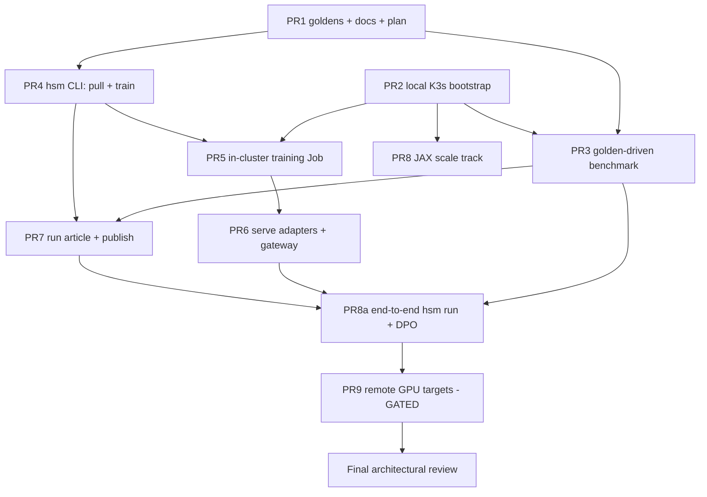

# Implementation plan

Goal: the parameterized run workflow in [workflow.md](workflow.md) -
select model -> fine-tune (full / LoRA / DPO) on a golden slice -> benchmark on
held-out cases -> write the run article -> serve via vLLM + OpenAI-compatible
gateway -> publish config + article to this repo.

## Process rules

- **One PR per work item below, executed in dependency order.** A PR merges
  only when its Evidence section is present in the PR description.
- **Evidence** = command transcript + key output from the local K3s cluster
  (or plain local execution where no cluster is involved). Phase 1 evidence
  is CPU/toy-scale by design; it proves the pipeline, not model quality.
- **Handoff**: each PR (a) ticks its checkbox here, (b) updates the "Next up"
  pointer at the bottom of this file, and (c) states in its description what
  the next PR consumes from it (files, interfaces, cluster state). This file
  is the single source of truth for sequencing.
- **Phase gate**: remote/GPU work (PR9) stays placeholder until the first
  full local pass (PR1-PR8) is demonstrated, then real boxes get plugged into
  `deploy/targets.yaml`.
- **Final architectural review** happens after PR9 (or after PR8 if phase 2
  is deferred): whole-system review against the checklist at the bottom.

## Dependency graph

## Work items

### Phase 1: local K3s (this MacBook)

- [x] **PR1 - Goldens, docs, plan** (this PR)
  Golden registry (`coding-mbpp`, `ecommerce-ecinstruct`, `voice-librispeech`)
  with schema, streaming `pull.py` (`--golden --split --limit --smoke`),
  workflow/JAX/local-K3s docs, this plan, `deploy/targets.yaml` with remote
  placeholders.
  *Evidence: pull commands with record counts for all three goldens.*
  *Hands off: canonical JSONL format + `goldens/pull.py` API to PR3/PR4.*

- [ ] **PR2 - Local K3s bootstrap**
  `deploy/scripts/local-k3s-up.sh` (colima + k3d per docs/local-k3s-macbook.md),
  build + import faster-whisper image, deploy it, green `smoke-test.sh`.
  Add a CPU stand-in text model deployment (e.g. Qwen2.5-0.5B-Instruct on a
  CPU-capable OpenAI-compatible server) so text benchmarks have a local target.
  *Evidence: `kubectl get nodes/pods`, smoke-test transcript against localhost.*
  *Hands off: running cluster + two live endpoints to PR3/PR5/PR6.*

- [ ] **PR3 - Golden-driven benchmark v2**
  Extend `benchmark/run_benchmark.py`: accept `--golden`/`--limit`/`--smoke`,
  metrics per modality (code pass@1 by executing MBPP `test_list` in a
  subprocess sandbox, text exact/contains, ASR WER via jiwer), JSON report to
  `runs/`. Keep domain-pack failure probes as a second suite.
  *Evidence: benchmark of the two local endpoints on smoke slices of all
  three goldens, report JSON committed as example.*
  *Hands off: report schema to PR7 (article) and PR8a (orchestrator).*

- [ ] **PR4 - `hsm` CLI: pull + train**
  `hsm` entrypoint (single Python package, `pyproject.toml`) with `hsm pull`
  and `hsm train`: golden slice -> LoRA SFT (reuses train/finetune_lora.py
  internals), run directory layout (`runs/<run-id>/config.yaml`, checkpoint).
  CPU smoke path: tiny model, <=100 items. `--method full` wired; `--method
  dpo` stubbed with a clear error until PR8a.
  *Evidence: local CPU LoRA run on 32 items of ecommerce-ecinstruct,
  decreasing loss, checkpoint + config.yaml produced.*
  *Hands off: run-dir contract to PR5/PR6/PR7.*

- [ ] **PR5 - In-cluster training Job**
  Containerize `hsm train`; K8s Job manifest (checkpoints to `local-path`
  PVC), `hsm train --target local` submits the Job, streams logs, retrieves
  the checkpoint. Same manifest parameterized for GPU (phase 2).
  *Evidence: Job completes on the k3d cluster, checkpoint retrieved locally.*
  *Hands off: Job template + submission code to PR8 (JAX) and PR9 (remote).*

- [ ] **PR6 - Serve fine-tuned checkpoints + gateway**
  vLLM `--enable-lora --lora-modules` wiring for adapters; single
  OpenAI-compatible gateway Service in front of all model Services (route by
  model name); `hsm serve <run-id> --target local`. Local CPU serving uses
  the PR2 stand-in server for adapters. GPU vLLM manifests updated for
  phase 2.
  *Evidence: chat completion against the gateway hitting base model AND the
  PR4/PR5 adapter, different outputs shown.*
  *Hands off: gateway URL contract to PR8a.*

- [ ] **PR7 - Run article + publish**
  `hsm report <run-id>`: generate `report.md` (config, slices, before/after
  metrics per category, sample wins/regressions). `hsm publish <run-id>`:
  commit `config.yaml` + `report.md` under `runs/` on a branch and open a PR
  to this repo.
  *Evidence: a real generated article from a PR4 run, published as a PR.*
  *Hands off: article format frozen; example run in repo history.*

- [ ] **PR8 - JAX scale track (topology)**
  `jax-train` image, Indexed Job + headless Service manifest per
  docs/training-jax-k8s.md, minimal Flax SFT loop with sharded golden input
  and Orbax checkpoint to PVC. 4-process CPU mesh locally.
  *Evidence: logs showing global device count 4 across pods, loss decreasing,
  checkpoint in PVC.*
  *Hands off: manifest scaled by env vars only; GPU variant ready for PR9.*

- [ ] **PR8a - End-to-end `hsm run` + DPO**
  `hsm run` chains pull -> train -> benchmark(before/after) -> report; adds
  `--method dpo` (TRL DPOTrainer, preference pairs derived from golden
  references vs base-model outputs); `--method full` exercised on the tiny
  model.
  *Evidence: single `hsm run` command transcript producing a complete
  `runs/<id>/` with article, on the local cluster.*
  *Hands off: the phase-1 complete demo; phase-2 gate opens.*

### Phase 2: remote GPU boxes (GATED - awaiting real boxes from the architect)

- [ ] **PR9 - Remote SSH targets**
  Fill `deploy/targets.yaml` placeholders with real box(es); `hsm --target
  ssh:<name>` provisions K3s (existing script), imports/pulls images, runs
  the same pipeline; multi-box K3s join for the JAX track; real Gemma +
  Ultravox vLLM deployments and real-scale golden runs (e.g. train-limit 100
  as the first requested demo).
  *Evidence: full `hsm run` transcript against a cloud GPU box; goldens
  benchmark numbers for Gemma, Ultravox, faster-whisper.*

- [ ] **Final architectural review**
  Whole-system review: interface stability (`hsm`, run-dir, report schema),
  security (SSH handling, HF tokens as Secrets, no weights in git), cost of
  a run, docs accuracy, deletion of dead scaffolding. Produces either sign-off
  or a punch-list PR.

## Priorities

1. Correctness of the loop (PR1-PR4) over breadth - a small honest pipeline first.
2. Cluster parity (PR5-PR6) - nothing may work locally that can't work in-cluster.
3. Reporting/publishing (PR7) before scale (PR8) - evidence culture first.
4. Scale and remote last (PR8/PR9) - only on top of a proven loop.

## Next up

**PR2 - Local K3s bootstrap.** Consumes from PR1: nothing at runtime; uses
docs/local-k3s-macbook.md as its spec. Blocked on nothing.
