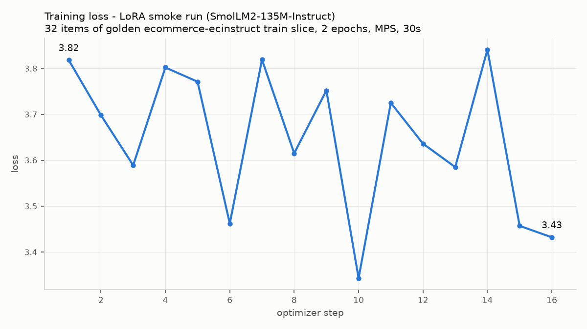

# Evidence: LoRA fine-tune smoke run on a golden slice

Date: 2026-07-26. Host: MacBook (Apple Silicon, torch MPS backend), no cluster
involved (data + training layer only). Proves the golden -> fine-tune path:
pull a parameterized slice of a golden dataset, fine-tune a model on the first
N items, produce a vLLM-loadable LoRA adapter.

## Commands

```bash
# pull the golden slice (streamed from HF, no full download)
python goldens/pull.py --golden ecommerce-ecinstruct --split train --limit 100
# -> wrote 100 records to goldens/cache/ecommerce-ecinstruct.train.jsonl

# fine-tune on the first 32 items (tiny model = CPU/MPS smoke scale)
python train/finetune_lora.py \
  --data goldens/cache/ecommerce-ecinstruct.train.jsonl \
  --model HuggingFaceTB/SmolLM2-135M-Instruct \
  --limit 32 --epochs 2 --out runs/smoke-lora-ecinstruct
```

## Output (excerpt)

```
loaded 32 examples from goldens/cache/ecommerce-ecinstruct.train.jsonl
{'loss': '3.818', 'learning_rate': '0.0002',    'epoch': '0.125'}
{'loss': '3.589', 'learning_rate': '0.000175',  'epoch': '0.375'}
{'loss': '3.462', 'learning_rate': '0.0001375', 'epoch': '0.75'}
{'loss': '3.432', 'learning_rate': '1.25e-05',  'epoch': '2'}
{'train_runtime': '30.26', 'train_samples_per_second': '2.115', 'train_loss': '3.647'}
adapter saved to runs/smoke-lora-ecinstruct
serve it with vLLM: --enable-lora --lora-modules ecommerce-ecinstruct.train=runs/smoke-lora-ecinstruct
```



## Produced artifact (not committed - weights policy)

```
runs/smoke-lora-ecinstruct/
├── adapter_config.json          (LoRA r=16, q/k/v/o projections)
├── adapter_model.safetensors    (7.4 MB)
├── chat_template.jinja
└── checkpoint-16/
```

## Interpretation

16 optimizer steps over 32 examples is pipeline-smoke scale: it demonstrates
the mechanics (golden slice in canonical format -> chat-formatted SFT -> LoRA
adapter ready for `vllm --enable-lora`), not model quality. The noisy but
downward loss (3.82 -> 3.43, min 3.34) is consistent with a 135M model seeing
32 examples twice. Quality numbers come from benchmark PRs on GPU targets
(phase 2).
