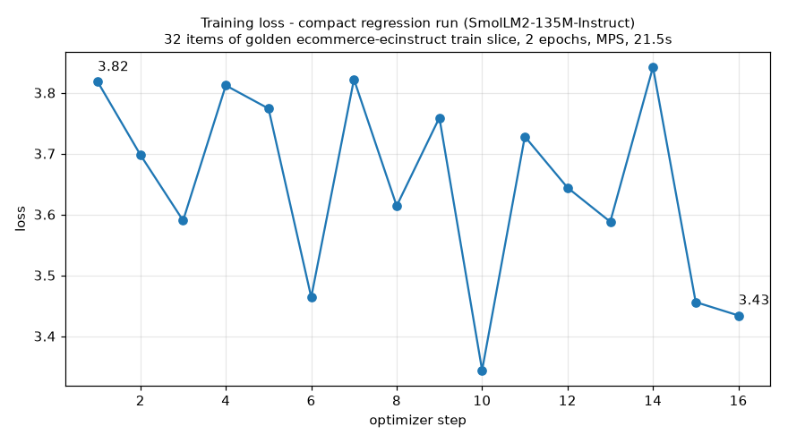

# Evidence: compact regression run against the accepted baseline

Date: 2026-07-28. Host: MacBook (Apple Silicon, torch MPS backend), data +
training layer only - the local k3d clusters were present but `kubectl` and
`docker` were not available in the execution environment, so the run executed
directly on the host, same as the
[baseline evidence](2026-07-26-lora-smoke.md). Evidence tier: **smoke** -
proves the pipeline and its stability, not model quality.

This is the compact regression defined in [ACCEPTANCE.md](../../ACCEPTANCE.md#compact-regression-per-pr-scale):
fixed golden slice, fixed smoke model, loss trajectory compared to the
previous accepted baseline.

## Commands (from `models/`)

```bash
python goldens/pull.py --golden ecommerce-ecinstruct --split train --limit 40
python train/finetune_lora.py \
  --data goldens/cache/ecommerce-ecinstruct.train.jsonl \
  --model HuggingFaceTB/SmolLM2-135M-Instruct \
  --limit 32 --epochs 2 --out <out-dir>
```

Full sanitized transcript:
[2026-07-28-regression-lora-smoke-transcript.txt](2026-07-28-regression-lora-smoke-transcript.txt).

## Regression comparison

| Metric | Baseline ([2026-07-26](2026-07-26-lora-smoke.md)) | This run | Delta |
|--------|------------------------|----------|-------|
| First-step loss | 3.82 | 3.818 | -0.002 |
| Final-step loss | 3.43 | 3.434 | +0.004 |
| Minimum loss | 3.34 | 3.344 | +0.004 |
| `train_loss` | 3.647 | 3.649 | +0.002 |
| Optimizer steps | 16 | 16 | 0 |
| `train_runtime` (s) | 30.26 | 21.53 | -8.7 (host variance) |

**Verdict: PASS.** The loss trajectory reproduces the accepted baseline
within noise (all loss deltas < 0.005); the golden -> fine-tune -> adapter
path is unchanged by the integration into the monorepo.



## Produced artifact (not committed - weights policy)

LoRA adapter (`adapter_model.safetensors`, ~7 MB) written to a scratch
directory outside the repository; vLLM-loadable via
`--enable-lora --lora-modules`.
