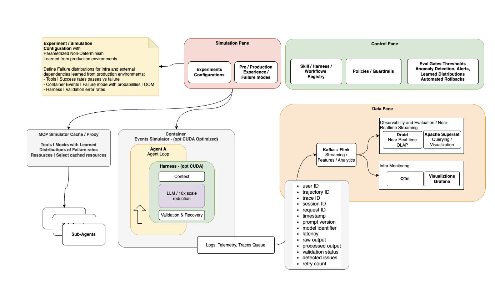
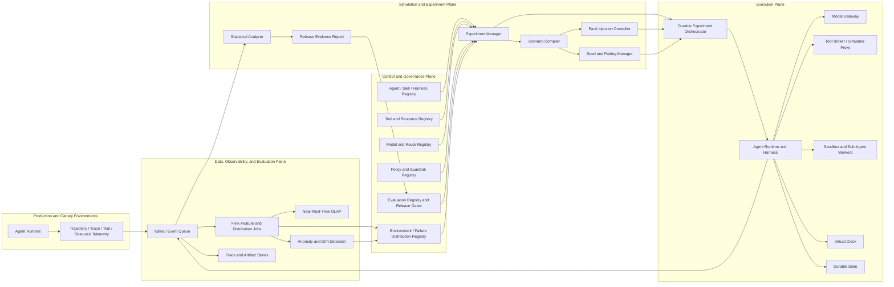

# Production-Informed Stochastic Simulation for Agentic Systems

## Product Requirements Document and Reference Architecture

**Subtitle:** Pre-release resilience evaluation for non-deterministic, multi-stage agent workflows  
**Audience:** Product leaders, architects, Staff/Principal engineers, AI infrastructure engineers, reliability engineers, evaluation teams, and platform teams  
**Status:** Working draft for architectural review  
**Version:** 0.1  
**Date:** July 16, 2026

---

## 0. Executive Abstract

Production AI agents should be treated as governed execution systems whose behavior emerges from the interaction of models, context, tools, sub-agents, infrastructure, policies, and recovery logic. A release can pass ordinary functional tests and still fail in production because the execution environment is non-deterministic: dependencies time out, context quality decays, sub-agent fan-out grows unexpectedly, containers exhaust memory, tools return partial results, retries amplify load, and model behavior varies between otherwise similar trajectories.

Traditional replay testing is necessary but insufficient. Historical production traces contain only failures and combinations that have already occurred. They do not represent the full set of plausible future states, correlated failures, timing combinations, or newly introduced interactions created by a candidate skill, prompt, model, workflow, or harness version.

This document proposes a **production-informed stochastic simulation platform** for agentic systems. The platform continuously learns failure characteristics from production telemetry, turns them into versioned environment and failure-distribution profiles, and executes candidate workflows inside a controlled simulation environment. Synthetic and cached dependency responses are mixed with faults sampled from production-derived distributions. The simulator measures task outcomes, validation and recovery behavior, cascading failures, resource amplification, policy compliance, cost, latency, and blast radius before release.

The central architectural thesis is:

> Agentic releases should be evaluated against a distribution of plausible production environments, not only against a fixed corpus of historical examples.

The platform creates a closed reliability loop:

```text
Production trajectories
  → structured telemetry and failure observations
  → near-real-time analysis and distribution estimation
  → versioned simulation environment profiles
  → baseline/candidate stochastic experiments
  → evaluation, anomaly discovery, and release gates
  → canary or blocked release
  → new production evidence
```

The economic thesis is equally important. Large experiment populations can often be executed with smaller models, cached dependency results, virtualized tools, compressed time, and accelerated infrastructure. A smaller number of calibration runs can then be repeated with the target production model and infrastructure. This creates a layered fidelity model that can substantially reduce the cost of pre-release resilience testing while preserving decision quality.

---

# Part I — Product Requirements Document

## 1. Product Definition

### 1.1 Working product name

**Production-Informed Agentic Simulation and Reliability Platform**

The name is descriptive rather than final. The product may later be packaged as a simulation fabric, resilience laboratory, agentic chaos platform, or pre-production reliability control plane.

### 1.2 Product statement

The product enables teams to test multi-stage AI agent workflows under realistic, probabilistic, and potentially cascading failure conditions before production release. It derives failure models from production observations, virtualizes tools and dependencies, injects faults into agent trajectories, evaluates baseline and candidate releases at scale, and produces evidence for release approval, rollback readiness, and harness improvement.

### 1.3 Core product principle

A production trace is evidence of what happened. A simulation profile is a model of what may plausibly happen.

The product must preserve this distinction. It should use production data to estimate conditions and dependencies, but it should not reduce simulation to replaying historical inputs.

---

## 2. Problem Statement

### 2.1 User problem

Teams releasing agentic workflows lack a reliable way to answer the following questions before deployment:

- How will the candidate behave when multiple dependencies fail in different orders?
- Will validation and recovery mechanisms contain failures or amplify them?
- Can one failing sub-agent trigger excessive fan-out, retries, token usage, or downstream load?
- Does a new skill, prompt, tool, model, or policy change alter the blast radius of known failures?
- Which failure combinations are absent from historical replay datasets but still plausible?
- Does the workflow degrade safely when the target model, tool, or region is unavailable?
- Are release gates based on average success masking low-frequency, high-impact failures?
- Can the same failure be reproduced for debugging after it is discovered stochastically?
- Can pre-production testing be performed at enough scale without using the most expensive models and live dependencies for every run?

### 2.2 Why existing approaches are insufficient

| Existing method | Value | Limitation for agentic systems |
|---|---|---|
| Unit and integration tests | Verify deterministic contracts and known branches. | Do not adequately model variable trajectories, semantic failures, probabilistic tool selection, or cascading behavior. |
| Golden datasets | Measure expected quality on curated cases. | Usually static, finite, and weak at representing environment failures or correlated timing conditions. |
| Production trace replay | Reproduces previously observed scenarios. | Cannot generate combinations, rates, or edge cases not present in the captured dataset. |
| Load testing | Measures throughput and infrastructure saturation. | Often treats requests as independent and does not model model/tool/recovery semantics. |
| Chaos engineering | Tests infrastructure and dependency resilience. | Typically lacks trajectory-level semantics, agent policy, context degradation, model variance, and evaluation of task correctness. |
| Red teaming | Discovers adversarial safety and security failures. | Usually episodic and not continuously calibrated to production failure distributions. |
| Canary releases | Limits exposure to real users. | Still exposes production to unknown failure modes and may not detect rare cascading failures quickly enough. |

The proposed platform combines the strongest elements of replay, evaluation, chaos engineering, load testing, and release governance, but operates at the level of **agent trajectories and governed outcomes**.

---

## 3. Product Goals and Non-Goals

### 3.1 Goals

1. **Learn from production without being limited to production history.**  
   Convert observed failures, latencies, resource states, and dependency behavior into versioned probabilistic models.

2. **Evaluate complete trajectories.**  
   Test planning, context, model calls, tools, sub-agents, validation, recovery, policy, and terminal outcomes as one governed execution.

3. **Measure resilience rather than only success.**  
   Determine whether a workflow can detect, contain, recover from, or safely degrade under failure.

4. **Expose cascading and high-blast-radius behavior.**  
   Measure propagation depth, fan-out, retry amplification, resource amplification, side effects, and detection delay.

5. **Enable reproducible stochastic testing.**  
   Every generated scenario must be reproducible using a versioned environment profile, experiment configuration, and random seed.

6. **Support economical testing at scale.**  
   Use cached dependencies, synthetic responses, virtual time, smaller models, model surrogates, and selective high-fidelity calibration.

7. **Provide release evidence.**  
   Produce statistically meaningful baseline-versus-candidate comparisons and integrate them with release gates.

8. **Discover novel behavior.**  
   Use anomaly detection and trajectory clustering to identify unexpected execution patterns not represented in predefined failure taxonomies.

9. **Improve the execution harness.**  
   Feed simulation findings into validation, recovery, policies, tool contracts, budgets, prompts, and runtime controls.

### 3.2 Non-goals for the initial product

- Perfectly predicting all future production behavior.
- Proving formal correctness of a non-deterministic workflow.
- Replacing online evaluation, canaries, incident response, or human approval.
- Simulating every external system at full fidelity.
- Training a foundation model from scratch.
- Permitting live destructive side effects during simulation.
- Automatically promoting a release without configurable organizational approval policy.
- Treating a smaller model as behaviorally identical to the target model without calibration evidence.

---

## 4. Target Users and Stakeholders

| Persona | Primary need | Product outcome |
|---|---|---|
| Agent/workflow engineer | Test a prompt, skill, tool, or orchestration change before release. | Reproducible experiment report and actionable failures. |
| AI reliability engineer | Validate recovery, retry, fallback, and graceful degradation. | Resilience curves, failure containment metrics, and regression gates. |
| Evaluation engineer | Define semantic and deterministic outcome criteria. | Versioned eval suites and statistically grounded comparisons. |
| Platform architect | Establish a reusable pre-production reliability fabric. | Stable component boundaries, registries, policies, and deployment patterns. |
| SRE/platform operations | Understand resource amplification and cascading infrastructure effects. | Fan-out, queue, latency, OOM, saturation, and recovery evidence. |
| Security/governance team | Ensure simulated and real actions obey policy and data boundaries. | Auditable tool authority, side-effect virtualization, and policy results. |
| Product owner | Decide whether candidate behavior is acceptable for users and economics. | Outcome, quality, risk, cost, and latency trade-off report. |
| Release manager | Gate, canary, roll back, or approve a release. | Machine-readable release recommendation with supporting evidence. |

---

## 5. Primary Use Cases

### UC-1 — Candidate workflow resilience test

A team changes an e-commerce support agent workflow. The candidate is run against transaction timeouts, partial inventory responses, context degradation, sub-agent failures, and container OOM conditions sampled from a production-derived profile. The platform compares the candidate with the current production baseline and reports whether recovery improved or failure propagation increased.

### UC-2 — Harness validation and recovery test

A new validation-and-repair controller is introduced. The platform deliberately emits malformed tool results, invalid structured model outputs, stale context, and retryable service errors. The experiment measures first-pass success, recovery success, terminal failure, retry cost, and whether the controller enters a runaway loop.

### UC-3 — Model or model-route migration

A workflow is moved to a new model or routing policy. The platform tests quality, tool-selection stability, recovery behavior, latency, and cost across the same paired scenario seeds. A small high-fidelity sample validates whether conclusions from lower-cost simulation models transfer to the target model.

### UC-4 — Sub-agent fan-out and cascade test

A multi-agent workflow delegates product, payment, inventory, and shipping analysis. The simulator injects slow and conflicting results, intermittent failures, and recursive delegation. The platform measures fan-out width, graph depth, duplicate actions, token amplification, queue pressure, and terminal user outcome.

### UC-5 — Infrastructure resilience experiment

Containers are terminated or constrained, queues are delayed, caches miss, and resource limits are reduced. The platform verifies durable state, idempotency, checkpoint recovery, fallback behavior, and whether retries create a secondary incident.

### UC-6 — Novel behavior discovery

Thousands of trajectories are generated from distributions and scenario mutations. Trajectory embeddings, graph features, or statistical signatures identify clusters that differ materially from the baseline. Analysts inspect minimized representative scenarios and convert important discoveries into permanent regression tests.

### UC-7 — Pre-canary release gate

A release pipeline invokes the platform automatically. The candidate is blocked if it exceeds thresholds for unsafe side effects, terminal failure, recovery regression, cost amplification, latency, cascade depth, or policy violations.

---

## 6. Product Scope and Capability Model

### 6.1 Core capability groups

1. **Production observation and feature extraction**
2. **Failure taxonomy and distribution estimation**
3. **Versioned environment-profile registry**
4. **Experiment and scenario definition**
5. **Tool, dependency, and time virtualization**
6. **Stochastic fault injection**
7. **Agent and harness execution**
8. **Trajectory telemetry and artifact capture**
9. **Evaluation and statistical comparison**
10. **Anomaly discovery and scenario minimization**
11. **Release gates and governance integration**
12. **Cost, capacity, and fidelity management**

### 6.2 Product boundary

The simulator does not replace the production agent runtime. It reuses the same agent definition, harness contracts, tool schemas, policies, validators, and telemetry model wherever possible, while replacing or wrapping external dependencies with controlled simulation adapters.

```text
Shared with production
├─ agent/workflow definition
├─ prompt and skill versions
├─ context assembly rules
├─ model gateway interface
├─ tool schemas and risk tiers
├─ policy bundles
├─ validation and recovery harness
├─ telemetry schema
└─ evaluation contracts

Simulation-specific
├─ environment profile
├─ failure-distribution package
├─ scenario compiler
├─ fault-injection controller
├─ tool/dependency simulator proxy
├─ virtual clock and acceleration controls
├─ random seed and paired-run controller
├─ experiment statistics
└─ release evidence report
```

---

## 7. Functional Requirements

Priority notation:

- **P0:** required for a useful minimum viable platform.
- **P1:** required for production-grade adoption.
- **P2:** advanced capability.

### 7.1 Production learning and distribution registry

| ID | Priority | Requirement |
|---|---:|---|
| FR-001 | P0 | Ingest trajectory, trace, model-call, tool-call, validation, recovery, latency, resource, and terminal-state events from production. |
| FR-002 | P0 | Normalize failures into a versioned taxonomy while retaining raw evidence references. |
| FR-003 | P0 | Estimate empirical rates and distributions for selected failure variables and workflow states. |
| FR-004 | P0 | Publish an immutable environment profile with source window, filters, confidence metadata, and schema version. |
| FR-005 | P0 | Allow manual expert-defined distributions when production data is sparse or unavailable. |
| FR-006 | P1 | Model conditional and correlated failures rather than assuming all events are independent. |
| FR-007 | P1 | Detect distribution drift and determine when an environment profile should be refreshed or invalidated. |
| FR-008 | P2 | Apply hierarchical or Bayesian estimation to share statistical strength across sparse tools, regions, workflow versions, or tenants. |

### 7.2 Experiment configuration

| ID | Priority | Requirement |
|---|---:|---|
| FR-010 | P0 | Define baseline and candidate agent, skill, prompt, model route, policy, and harness versions. |
| FR-011 | P0 | Select an environment profile and override specific failure variables for targeted tests. |
| FR-012 | P0 | Define population size, seeds, concurrency, budgets, timeout, and evaluation suite. |
| FR-013 | P0 | Support paired baseline/candidate runs using identical scenario seeds and initial conditions. |
| FR-014 | P0 | Store experiment definitions as immutable versioned artifacts. |
| FR-015 | P1 | Support scenario constraints such as “payment timeout followed by inventory staleness within three steps.” |
| FR-016 | P1 | Support stress sweeps that vary failure probability, latency, load, context size, or resource limits across a range. |
| FR-017 | P2 | Generate experiments automatically from detected production drift or anomalies. |

### 7.3 Simulation and fault injection

| ID | Priority | Requirement |
|---|---:|---|
| FR-020 | P0 | Virtualize external tools and dependencies through a broker or MCP-style simulator proxy. |
| FR-021 | P0 | Return synthetic, cached, mutated, delayed, partial, malformed, conflicting, or failed dependency responses. |
| FR-022 | P0 | Inject infrastructure events such as container termination, CPU throttling, memory pressure, OOM, queue delay, and cache miss. |
| FR-023 | P0 | Inject model and context failures such as invalid output, context truncation, stale evidence, retrieval miss, and response delay. |
| FR-024 | P0 | Ensure simulations cannot perform unauthorized real external side effects. |
| FR-025 | P0 | Record each injected event with scenario state, probability source, timing, and seed. |
| FR-026 | P1 | Model conditional sequences and correlated failures across tools, agents, infrastructure, and time. |
| FR-027 | P1 | Support virtual time and accelerated dependency completion where semantics permit. |
| FR-028 | P1 | Support multi-agent delegation and preserve authority, trace, and scenario propagation. |
| FR-029 | P2 | Mutate scenarios to search for new failure combinations and automatically minimize discovered failures. |

### 7.4 Execution and harness integration

| ID | Priority | Requirement |
|---|---:|---|
| FR-030 | P0 | Execute the same agent harness interfaces used in pre-production or production. |
| FR-031 | P0 | Preserve context construction, model routing, output contracts, tool validation, policies, budgets, and recovery logic. |
| FR-032 | P0 | Enforce trajectory-level token, action, retry, latency, and cost budgets. |
| FR-033 | P0 | Support durable checkpoints and idempotent restart after simulated process failure. |
| FR-034 | P0 | Propagate `experiment_id`, `simulation_run_id`, `trajectory_id`, `trace_id`, and `request_id` through every component. |
| FR-035 | P1 | Run on distributed CPU/GPU workers with workload and tenant isolation. |
| FR-036 | P1 | Permit model substitution according to an explicit fidelity policy. |
| FR-037 | P2 | Support learned model surrogates for selected steps while retaining calibration checks. |

### 7.5 Evaluation and release evidence

| ID | Priority | Requirement |
|---|---:|---|
| FR-040 | P0 | Run deterministic validation, semantic evaluation, policy checks, and terminal-outcome classification. |
| FR-041 | P0 | Compare baseline and candidate across matched scenarios. |
| FR-042 | P0 | Report success, recovery, cost, latency, retry, fan-out, policy, and blast-radius metrics. |
| FR-043 | P0 | Include uncertainty or confidence estimates appropriate to the metric and sample design. |
| FR-044 | P0 | Produce machine-readable and human-readable experiment reports. |
| FR-045 | P0 | Support pass, warn, block, and requires-human-review release decisions. |
| FR-046 | P1 | Detect and rank anomalous trajectory structures or outcome clusters. |
| FR-047 | P1 | Link every failed or anomalous result to a reproducible run configuration. |
| FR-048 | P1 | Export important scenarios as permanent golden or regression tests. |
| FR-049 | P2 | Recommend likely harness, policy, prompt, tool-contract, or infrastructure improvements. |

---

## 8. Non-Functional Requirements

| Category | Requirement |
|---|---|
| Reproducibility | A run must be reproducible from immutable artifact versions, environment profile, simulator version, and seed. |
| Isolation | Simulation workloads and artifacts must be isolated by tenant, project, and environment. |
| Safety | Real destructive side effects must be denied by default; exceptions require explicit sandboxed test resources and policy. |
| Security | Secrets must remain outside model-visible context; simulator adapters use scoped credentials or synthetic credentials. |
| Privacy | Raw production content should not be copied into simulation unless policy permits; prefer synthetic, redacted, tokenized, or cached abstractions. |
| Reliability | Experiment orchestration must checkpoint, resume, and distinguish simulator failure from candidate failure. |
| Scalability | The platform should scale horizontally across large populations of independent and multi-agent runs. |
| Performance | Virtualized dependencies and time acceleration should avoid unnecessary wall-clock delay. |
| Statistical integrity | Reports must identify sample size, pairing method, exclusions, profile age, and uncertainty. |
| Fidelity transparency | Every result must state which components were real, simulated, cached, substituted, or accelerated. |
| Observability | The platform itself must expose infrastructure metrics separately from simulated agent outcomes. |
| Portability | Agent, tool, model, evaluation, policy, telemetry, and state interfaces should remain framework-neutral. |
| Operability | Profiles, experiments, failures, reports, and release decisions must be searchable and auditable. |
| Economic control | The platform must track simulation cost and support budgets by project, experiment, model, and fidelity tier. |

---

## 9. Success Metrics

### 9.1 Product effectiveness metrics

| Metric | Definition |
|---|---|
| Pre-release defect discovery rate | Material failures discovered in simulation before production exposure. |
| Escaped-failure rate | Production failures that were not represented or detected in the prior simulation program. |
| Regression prevention rate | Candidate releases blocked or corrected because of measured degradation. |
| Harness recovery improvement | Change in recovered-success rate after simulation-informed harness changes. |
| Novel anomaly yield | Actionable new behavior clusters discovered per experiment or compute budget. |
| Scenario-to-regression conversion | Percentage of material discoveries converted into permanent tests. |
| Mean time to reproduce | Time from finding a stochastic failure to producing a deterministic replay. |
| Simulation calibration error | Difference between predicted and observed production rates for comparable conditions. |

### 9.2 Agent reliability metrics

- Task success rate
- First-pass success rate
- Recovered-success rate
- Partial-success and safe-degradation rate
- Terminal failure rate
- Validation failure rate by class
- Policy block and policy violation rate
- Unsafe or irreversible side-effect rate
- Retry frequency and retry depth
- Tool failure and tool-argument rejection rate
- Sub-agent fan-out width and delegation depth
- Duplicate action rate
- Context degradation sensitivity
- Trajectory latency p50/p95/p99
- Token, model-call, and tool-call amplification
- Cost per successful governed task
- Cascade depth and propagation width
- Detection delay and containment time

### 9.3 Platform efficiency metrics

- Simulated trajectories per compute hour
- Cost per 1,000 trajectories
- Acceleration factor relative to wall-clock execution
- Cache/synthetic response utilization
- Percentage of runs using each fidelity tier
- Simulator infrastructure failure rate
- Experiment queue wait time
- Artifact storage per trajectory

---

## 10. MVP Definition and Acceptance Criteria

### 10.1 Initial reference workflow

A bounded e-commerce support workflow with:

- one primary agent;
- optional payment, inventory, shipping, and policy sub-agents;
- transaction-status and inventory tools;
- structured terminal outcome;
- validation and bounded recovery;
- no live external side effects.

### 10.2 Initial failure classes

1. Transaction tool timeout or failure
2. Context degradation or stale context
3. Sub-agent fan-out or delegated-agent failure
4. Container memory pressure, crash, or OOM

Optional fifth class: malformed model or tool output.

### 10.3 MVP acceptance criteria

The first release should demonstrate that it can:

- ingest and normalize production-like trajectory telemetry;
- produce a versioned environment profile from observed failure rates;
- define baseline and candidate experiments;
- run at least hundreds to low thousands of paired stochastic trajectories in a repeatable local or cluster environment;
- inject all initial failure classes and record the exact injected events;
- virtualize tool responses without performing real external transactions;
- reproduce a selected failure from seed and artifact versions;
- compare baseline and candidate across success, recovery, latency, cost, retries, fan-out, and cascade metrics;
- produce a release recommendation and supporting evidence;
- export a discovered scenario as a regression test;
- clearly distinguish candidate failure, simulator failure, and evaluation failure.

Throughput and cost targets should be finalized after an initial benchmark because they depend on model size, workflow depth, hardware, and fidelity tier.

---

# Part II — Architecture Review

## 11. Review of the Initial Architectural Sketch



*Figure 1 — Initial architectural sketch used as the basis for formalization.*

### 11.1 Architectural interpretation

The sketch defines three principal planes and one embedded execution environment:

- **Simulation Plane:** experiment configurations and learned pre-production/production failure modes.
- **Control Plane:** workflow and harness registry, policies and guardrails, evaluation thresholds, anomaly detection, alerts, learned distributions, and rollback controls.
- **Data Plane:** trajectory telemetry, streaming analysis, near-real-time OLAP, query/visualization, and infrastructure monitoring.
- **Simulation Execution Environment:** agent loop, context, model, validation and recovery, simulator cache/proxy, sub-agents, and event/telemetry emission.

This is a strong foundation. The design already expresses the most important product insight: production observations are transformed into simulation conditions that are applied before release.

### 11.2 Architectural strengths

1. **Closed-loop production learning**  
   The architecture connects production evidence, near-real-time analysis, learned failure distributions, pre-release simulation, evaluation gates, and rollback.

2. **Harness-centered execution**  
   Validation and recovery remain inside the agent execution loop rather than being treated as an offline reporting concern.

3. **Trajectory-first telemetry**  
   User, session, trajectory, trace, request, prompt, model, latency, raw/processed output, validation, issue, and retry fields support full execution reconstruction.

4. **Separation of agent monitoring and infrastructure monitoring**  
   Near-real-time evaluation analytics and OpenTelemetry/Grafana infrastructure signals are both present and can be correlated without conflating them.

5. **Virtualized tool and resource access**  
   The simulator proxy/cache creates a boundary where learned distributions, synthetic resources, faults, and accelerated dependencies can be introduced.

6. **Multi-agent awareness**  
   Sub-agents are represented as part of the simulation surface, enabling fan-out, delegation, and cascade testing.

7. **Economic optimization path**  
   The design explicitly allows cheaper models and optional accelerated execution rather than requiring full production fidelity for every run.

### 11.3 Gaps to formalize

The following additions are recommended for the reference architecture:

| Gap | Why it matters | Recommended component or decision |
|---|---|---|
| Distribution artifact ownership | Learned probabilities must be immutable, explainable, and reproducible. | Environment and Failure Distribution Registry |
| Conditional dependency model | Independent failure rates miss cascades and shared causes. | Conditional Scenario Model / Correlation Graph |
| Experiment reproducibility | Stochastic failures must be replayable. | Seed Manager and Immutable Experiment Manifest |
| Baseline/candidate pairing | Unpaired populations can create noisy comparisons. | Paired Scenario Controller |
| Side-effect containment | A simulator must not accidentally invoke production actions. | Tool Broker with Simulation Policy and Synthetic Credentials |
| Virtual time | Real dependency delays make large experiments impractical. | Simulation Clock and Time-Compression Service |
| Statistical decision layer | Raw averages are insufficient for release gates. | Experiment Analyzer and Confidence/Uncertainty Service |
| Simulator observability | Platform failures must not be mislabeled as agent failures. | Separate Simulation Infrastructure Telemetry |
| Model substitution policy | Smaller-model savings can reduce behavioral fidelity. | Fidelity Policy, Calibration Runs, and Transfer Checks |
| Scenario minimization | Complex failures need a small reproducible example. | Failure Shrinker / Delta Debugger |
| Artifact retention | Raw outputs, tool payloads, and synthetic inputs need lifecycle rules. | Experiment Artifact Store and Retention Policy |
| Release integration | Results need to block, warn, or approve through a stable interface. | Release Evidence API and Gate Adapter |

### 11.4 Recommended plane model

The initial three-plane model should be expanded to four explicit planes while preserving the original terminology:

1. **Control and Governance Plane**
2. **Simulation and Experiment Plane**
3. **Execution Plane**
4. **Data, Observability, and Evaluation Plane**

The execution plane is made explicit because it has independent scaling, isolation, security, model routing, tool brokering, and durable-state responsibilities.

---

# Part III — Reference Architecture

## 12. Architectural Thesis and Design Principles

### 12.1 Architectural thesis

The simulator is not a separate mock application. It is an alternate governed environment for the same agent execution contracts.

A candidate should enter simulation with the same:

- agent and skill definitions;
- instruction hierarchy;
- context-management rules;
- model-gateway interface;
- tool schemas;
- identity and authority model;
- policy bindings;
- output contracts;
- validation and recovery harness;
- budgets;
- telemetry schema;
- terminal-state model.

The environment then substitutes controlled models of tools, resources, faults, timing, load, and selected infrastructure behavior.

### 12.2 Design principles

1. **Treat the trajectory as the unit of behavior.**
2. **Treat the experiment manifest as the unit of reproducibility.**
3. **Separate model intelligence from runtime authority.**
4. **Broker all external tools and side effects.**
5. **Learn distributions from production but version them independently of production.**
6. **Model conditional and correlated failures, not only isolated rates.**
7. **Pair baseline and candidate scenarios whenever possible.**
8. **Use multiple fidelity tiers and make substitutions explicit.**
9. **Distinguish agent failure, dependency failure, simulator failure, and evaluator failure.**
10. **Budget tokens, actions, retries, time, fan-out, and cost.**
11. **Turn every important discovery into a reproducible regression asset.**
12. **Use simulation to reduce production exposure, not to claim perfect prediction.**

---

## 13. Logical Architecture



---

## 14. Plane Responsibilities

### 14.1 Control and Governance Plane

| Component | Responsibility |
|---|---|
| Agent/skill/harness registry | Version agent definitions, prompts, workflow graphs, validation, recovery, and ownership. |
| Tool/resource registry | Store tool schemas, simulator adapters, risk tiers, locality, auth scopes, and side-effect classes. |
| Model registry and gateway policy | Define approved models, routes, substitutions, fidelity roles, cost, latency, and fallback. |
| Policy/guardrail registry | Define identity, tool authority, data boundary, budget, approval, and simulation restrictions. |
| Evaluation registry | Store deterministic validators, semantic evaluators, outcome classifiers, thresholds, and goldens. |
| Environment/distribution registry | Store immutable production-derived or expert-authored environment profiles. |
| Release manager | Combine experiment evidence with policy to produce pass, warn, block, or review decisions. |
| Audit and lineage registry | Link every report to source telemetry window, profiles, code, images, models, and policies. |

### 14.2 Simulation and Experiment Plane

| Component | Responsibility |
|---|---|
| Experiment manager | Accept manifest, resolve artifacts, schedule baseline/candidate populations, track lifecycle. |
| Scenario compiler | Convert distributions, constraints, workflow state, and seeds into executable scenario plans. |
| Fault-injection controller | Trigger tool, context, model, infrastructure, policy, or timing events at defined states. |
| Seed and pairing manager | Produce reproducible random streams and matched baseline/candidate conditions. |
| Fidelity controller | Select real, cached, synthetic, surrogate, or target components by experiment stage. |
| Scenario search | Mutate probabilities and sequences to discover weak regions of the behavior space. |
| Failure minimizer | Reduce a complex failing scenario to a smaller reproducible sequence. |
| Experiment analyzer | Compute metrics, uncertainty, sensitivity, resilience curves, and candidate deltas. |

### 14.3 Execution Plane

| Component | Responsibility |
|---|---|
| Durable orchestrator | Schedule trajectories, checkpoint state, resume workers, and separate platform from candidate failures. |
| Agent runtime | Execute observe/reason/act/tool/delegate/validate/recover loop. |
| Agent harness | Assemble input, enforce contracts, broker actions, apply budgets, emit telemetry, and recover. |
| Context manager | Build synthetic or authorized context, inject degradation, rank, compress, and track provenance. |
| Model gateway | Route target, smaller, local, or surrogate models according to fidelity policy. |
| Tool broker/simulator proxy | Serve cached or synthetic results, inject faults, virtualize side effects, and enforce schemas. |
| Sandbox pool | Execute code, browser, file, or selected infrastructure tasks with resource and network isolation. |
| Sub-agent workers | Execute delegated agents with inherited trace, authority, scenario, and budget. |
| Virtual clock | Compress delays, control deadlines, and preserve event ordering semantics. |
| Durable state store | Persist trajectory state, checkpoints, idempotency keys, approvals, and terminal outcome. |

### 14.4 Data, Observability, and Evaluation Plane

| Component | Responsibility |
|---|---|
| Event queue | Carry production and simulation telemetry with schema versioning. |
| Streaming feature jobs | Compute failure rates, conditional features, latency distributions, resource indicators, and aggregates. |
| Near-real-time OLAP | Support trajectory slicing, issue analysis, release comparison, and incident investigation. |
| Trace store | Preserve distributed trace and delegation graph. |
| Artifact store | Preserve raw/processed outputs, context references, tool payloads, scenario manifests, and evaluator evidence. |
| Anomaly and drift service | Detect new behavior clusters, distribution changes, and simulation-to-production divergence. |
| Infrastructure monitoring | Monitor simulator workers, queues, GPU/CPU/memory, storage, and platform SLOs through OpenTelemetry and Grafana. |
| Evaluation service | Execute and store deterministic, semantic, policy, and outcome evaluations. |

---

## 15. End-to-End Lifecycle

### 15.1 Production learning lifecycle

```text
1. Agent runtime emits structured events.
2. Streaming jobs classify failures and compute contextual features.
3. Data is grouped by workflow, version, tool, model, region, load, and state.
4. Distribution estimators fit empirical or parametric models.
5. Drift, sparsity, and confidence checks are applied.
6. A proposed environment profile is created.
7. Automated checks and optional expert review approve the profile.
8. The immutable profile is published to the registry.
```

### 15.2 Experiment lifecycle

```text
Draft experiment
  → resolve baseline/candidate artifacts
  → select environment profile and fidelity tier
  → compile paired scenarios and seeds
  → validate side-effect and data policies
  → schedule execution population
  → collect trajectory evidence
  → evaluate outcomes and anomalies
  → compare baseline and candidate
  → issue release evidence
  → export regressions and recommendations
```

### 15.3 Release lifecycle

```text
Offline deterministic tests
  → stochastic simulation
  → targeted high-fidelity calibration
  → release gate
  → canary
  → online evaluation and drift detection
  → progressive rollout or rollback
```

---

## 16. Environment and Failure Distribution Model

### 16.1 Environment profile

An environment profile is an immutable package describing the conditions under which an experiment population is sampled.

Recommended fields:

```yaml
environment_profile_id: env-ecommerce-us-v17
schema_version: 1
created_at: 2026-07-16T18:00:00Z
source:
  environment: production
  workflow_ids: [ecommerce_support]
  time_window: [2026-07-01, 2026-07-14]
  regions: [us-west]
  sample_count: 1842500
filters:
  agent_versions: [2.8.x]
  excluded_incidents: []
variables:
  payment_timeout:
    model: conditional_bernoulli
    parameters_ref: artifact://distributions/payment_timeout_v17
  payment_latency_ms:
    model: empirical_heavy_tail
    parameters_ref: artifact://distributions/payment_latency_v17
  container_oom:
    model: hazard
    conditions: [context_tokens, fanout, concurrent_runs, memory_limit]
  context_staleness:
    model: categorical
    conditions: [source_age, retrieval_score, cache_state]
correlations:
  graph_ref: artifact://distributions/dependency_graph_v17
confidence:
  sparse_segments: [shipping_tool.region_x]
  warnings: []
review:
  status: approved
  approver: reliability-policy
```

### 16.2 Failure dimensions

| Dimension | Examples |
|---|---|
| Model behavior | malformed output, unsupported assertion, tool-selection variance, refusal, latency, truncation |
| Context and retrieval | stale evidence, missing document, retrieval miss, conflicting sources, context overflow, context rot |
| Tool and dependency | timeout, 5xx, rate limit, partial response, schema drift, inconsistent read, transaction rejection |
| Orchestration | lost checkpoint, duplicate delivery, retry storm, deadlock, queue delay, out-of-order result |
| Multi-agent | fan-out explosion, conflicting sub-agent conclusions, recursive delegation, authority loss |
| Infrastructure | container crash, OOM, CPU/GPU throttling, network partition, cache miss, storage delay |
| Governance | policy deny, approval timeout, region restriction, budget exhaustion, credential expiration |
| Data quality | missing field, malformed payload, stale cache, invalid identifier, duplicate event |
| Human interaction | delayed approval, ambiguous clarification, contradictory correction, abandonment |

### 16.3 Distribution progression

The platform should support an incremental sophistication model.

| Level | Model | Suitable use |
|---|---|---|
| L0 | Fixed scripted fault | Deterministic regression and development debugging. |
| L1 | Independent Bernoulli/categorical rates | MVP and low-complexity failure injection. |
| L2 | Conditional distributions | Rates vary by tool, workflow state, model, load, region, or retry count. |
| L3 | Temporal/Markov or hazard models | Failure probability depends on prior state and duration. |
| L4 | Correlated joint models or dependency graphs | Shared causes and cascading failures across components. |
| L5 | Adaptive generative scenario search | Explore weak regions and novel combinations under constraints. |

The architecture should begin with L1/L2 for interpretability and advance only when data volume and validation justify the added complexity.

### 16.4 Conditional failure model

A useful conceptual form is:

```text
P(failure at step t |
  workflow state,
  tool or model,
  region,
  current load,
  context size and quality,
  prior failures,
  retry count,
  fan-out,
  resource limits,
  elapsed virtual time)
```

This avoids treating a tool timeout during normal load as equivalent to a timeout after retries, growing context, and increasing fan-out.

### 16.5 Distribution governance

Every profile should include:

- source and time window;
- workflow/model/tool versions represented;
- sample size and sparse segments;
- estimator and parameters;
- correlation assumptions;
- excluded data and incident handling;
- confidence or uncertainty metadata;
- approval state;
- expiration or drift policy;
- privacy and retention classification.

A distribution profile is a release artifact and should be governed with the same discipline as prompts, models, tools, and policies.

---

## 17. Experiment Manifest

A canonical experiment manifest should be human-readable, machine-validatable, and immutable after execution starts.

```yaml
experiment_id: exp-ecommerce-skill-3.2.0
purpose: pre-release resilience comparison
baseline:
  agent_version: 3.1.4
  harness_version: 2.7.1
  prompt_version: support-v18
  model_route: production-default
candidate:
  agent_version: 3.2.0
  harness_version: 2.8.0
  prompt_version: support-v19
  model_route: candidate-default
environment_profile: env-ecommerce-us-v17
scenario:
  population: 5000
  pairing: matched_seed
  root_seed: 834091
  constraints:
    - no_real_external_side_effects
  overrides:
    payment_timeout_probability_multiplier: 1.0
fidelity:
  default_model_role: economical_simulation
  target_model_calibration_sample: 250
  tools: cached_and_synthetic
  time: accelerated
budgets:
  max_steps: 40
  max_sub_agents: 8
  max_retries: 4
  max_tokens: 80000
  max_virtual_duration: PT15M
evaluation_suite: ecommerce-release-v6
release_policy: customer-facing-medium-risk-v3
artifacts:
  retain_failed_runs_days: 90
  retain_success_sample_percent: 2
```

---

## 18. Tool and Dependency Simulation

### 18.1 Tool-broker rule

Agents should never switch between real and simulated tools by changing prompt text. The same typed tool interface should be resolved by the runtime to an environment-specific broker.

```text
Agent proposes tool call
  → schema validation
  → identity and policy check
  → simulation route resolution
  → scenario/fault decision
  → cached, synthetic, mutated, delayed, failed, or sandboxed response
  → result validation
  → telemetry and artifact capture
```

### 18.2 Simulator response modes

| Mode | Description |
|---|---|
| Cached success | Return a previously captured and sanitized successful response. |
| Synthetic success | Generate a valid response from schema and scenario state. |
| Mutated response | Modify selected fields, ordering, freshness, or consistency. |
| Partial response | Omit fields or return incomplete pagination/content. |
| Malformed response | Violate schema or encoding intentionally. |
| Delayed response | Complete after virtual or real delay. |
| Retryable failure | Timeout, rate limit, transient network or 5xx error. |
| Terminal failure | Permanent rejection, not found, invalid transaction, or policy block. |
| Conflicting response | Return data inconsistent with another tool or earlier step. |
| Side-effect sandbox | Execute against an isolated test tenant or ephemeral resource. |

### 18.3 Statefulness

Many agent tools are not stateless. The simulator should maintain scenario state such as:

- order status;
- inventory quantity;
- payment authorization state;
- prior tool writes;
- generated messages;
- user clarification state;
- sub-agent outputs;
- idempotency keys;
- virtual clock;
- dependency health state.

Without stateful simulation, the platform may test isolated calls but fail to represent workflow-level causality.

---

## 19. Agent Harness Integration

### 19.1 Harness responsibilities

The harness remains the core operational boundary around the model. It owns:

- instruction compilation;
- context retrieval, authorization, compression, and provenance;
- model routing;
- output parsing and classification;
- tool-call schema validation;
- identity, policy, and budget checks;
- sandbox and sub-agent delegation;
- output validation;
- retry, repair, fallback, degrade, block, or human escalation;
- durable state;
- telemetry and artifacts;
- terminal-state classification.

### 19.2 Simulation hooks

The harness should expose controlled hooks rather than embedding simulator-specific logic throughout business code.

| Hook | Purpose |
|---|---|
| Before context build | Inject missing, stale, conflicting, oversized, or low-confidence context. |
| Before model call | Select fidelity route, delay, resource state, or model availability event. |
| After model output | Inject transport truncation or evaluate model-produced malformed output naturally. |
| Before tool execution | Apply fault decision, side-effect virtualization, latency, or dependency state. |
| After tool result | Mutate, corrupt, delay, duplicate, or conflict result. |
| Before delegation | Limit or amplify fan-out, fail a sub-agent, or alter inherited context. |
| Before checkpoint | Simulate process failure or persistence delay. |
| Before recovery | Test retry controller, fallback route, circuit breaker, or budget exhaustion. |
| Before terminal output | Apply final validation, semantic evaluation, and policy checks. |

The hooks must be observable and versioned. Hidden fault injection would make results difficult to explain.

---

## 20. Telemetry and Canonical Data Model

### 20.1 Telemetry hierarchy

```text
Experiment
└── Simulation run
    └── User or synthetic actor
        └── Session
            └── Trajectory
                └── Trace
                    └── Span / model call / tool call / agent delegation
                        └── output + validation + recovery + fault metadata
```

### 20.2 Required identifiers and fields

The production telemetry model should be extended with simulation-specific lineage.

| Field | Purpose |
|---|---|
| `experiment_id` | Groups all populations and reports for one experiment. |
| `simulation_run_id` | Identifies one executable scenario instance. |
| `scenario_id` | Identifies the compiled scenario plan. |
| `root_seed` / `run_seed` | Reproduces stochastic decisions. |
| `environment_profile_id` | Identifies the learned or authored distribution package. |
| `distribution_version` | Identifies exact parameters used for a decision. |
| `baseline_or_candidate` | Supports matched comparison. |
| `fidelity_tier` | States model/tool/infrastructure fidelity. |
| `fault_event_id` | Identifies each injected event. |
| `fault_type` | Normalized failure taxonomy. |
| `fault_probability` | Probability used at the decision point. |
| `fault_conditions` | Workflow/resource features conditioning the probability. |
| `virtual_timestamp` | Orders simulated time. |
| `wall_timestamp` | Supports platform operations and performance analysis. |
| `user_id` | Synthetic, hashed, or permitted user attribution. |
| `session_id` | Interaction grouping. |
| `trajectory_id` | Full goal pursuit and primary behavior key. |
| `trace_id` | Distributed execution correlation. |
| `request_id` | Atomic model/tool/service request lookup. |
| `prompt_version` | Prompt provenance. |
| `model_identifier` | Model/provider/deployment attribution. |
| `latency_ms` | Wall and optionally virtual latency. |
| `raw_output_ref` | Restricted evidence before processing. |
| `processed_output_ref` | Artifact consumed downstream. |
| `validation_status` | Passed, failed, recovered, blocked, or degraded. |
| `detected_issues` | Failure taxonomy labels. |
| `retry_count` | Recovery and amplification analysis. |
| `terminal_state` | Succeeded, partial, degraded, blocked, review, recoverable failure, terminal failure. |

### 20.3 Event example

```json
{
  "experiment_id": "exp-ecommerce-skill-3.2.0",
  "simulation_run_id": "simrun-004291",
  "scenario_id": "scenario-00883",
  "run_seed": 9384102,
  "environment_profile_id": "env-ecommerce-us-v17",
  "baseline_or_candidate": "candidate",
  "fidelity_tier": "F1-economical",
  "trajectory_id": "traj-92210",
  "trace_id": "5b8efff798038103d269b633813fc60c",
  "request_id": "req-000349",
  "virtual_timestamp": "2026-07-16T18:00:11.400Z",
  "wall_timestamp": "2026-07-16T18:00:01.912Z",
  "agent_id": "ecommerce_support_agent",
  "agent_version": "3.2.0",
  "prompt_version": "support-v19",
  "model_identifier": "simulation-route:small-model-v4",
  "tool_name": "payment.get_transaction",
  "fault_event": {
    "fault_event_id": "fault-1102",
    "fault_type": "dependency_timeout",
    "fault_probability": 0.031,
    "fault_conditions": {
      "retry_count": 0,
      "dependency_health": "degraded",
      "virtual_load_band": "high"
    }
  },
  "latency_ms_wall": 12,
  "latency_ms_virtual": 3500,
  "validation_status": "recovered",
  "detected_issues": ["tool_timeout"],
  "retry_count": 1,
  "terminal_state": null
}
```

---

## 21. Streaming, Storage, and Analysis Architecture

### 21.1 Streaming path

```text
Agent runtime / simulator proxy / model gateway / policy engine / orchestrator
  → telemetry queue
  → stream normalization and feature extraction
  → near-real-time OLAP
  → distribution estimation and drift detection
  → dashboards, alerts, experiment analytics, and profile publication
```

### 21.2 Reference technology mapping

The logical design is technology-neutral. The initial sketch maps naturally to:

| Function | Illustrative technology |
|---|---|
| Event queue | Kafka or compatible distributed log |
| Streaming features and distributions | Flink |
| Near-real-time OLAP | Druid |
| Query and visualization | Apache Superset |
| Infrastructure telemetry | OpenTelemetry |
| Infrastructure dashboards | Grafana |
| Durable experiment metadata | PostgreSQL or equivalent relational store |
| Trace storage | Tempo, Jaeger-compatible store, or columnar trace platform |
| Artifact storage | S3-compatible object storage |
| Experiment orchestration | Temporal, Kubernetes jobs, Argo Workflows, or a custom durable controller |

### 21.3 Data separation

Production and simulation data should share schemas but preserve strong environment labels and access boundaries.

- Production raw artifacts remain restricted.
- Simulation may use synthetic or sanitized cached artifacts.
- Aggregated distributions should avoid leaking raw sensitive content.
- Simulation results should never be ingested into production-rate estimators without an explicit environment filter.
- Platform telemetry should be separated from simulated agent telemetry to avoid contaminating failure metrics.

---

## 22. Evaluation Model

### 22.1 Evaluation layers

| Layer | Example checks |
|---|---|
| Contract | JSON/schema validity, required fields, type constraints, tool arguments. |
| Task outcome | User goal completed, transaction state correct, answer resolves request. |
| Evidence | Claims supported by authorized context or tool results. |
| Policy | Tool authority, data boundary, action budget, approval requirement, safety rule. |
| Recovery | Failure detected, retry classified correctly, fallback succeeds, loop bounded. |
| Resilience | Outcome under faults relative to no-fault baseline. |
| Economics | Tokens, model calls, tools, retries, infrastructure, human review, and total cost. |
| Performance | Wall and virtual latency, queue delay, tail behavior, completion time. |
| Propagation | Fan-out, cascade depth, affected components, duplicate actions, downstream load. |
| User impact | Correctness, clarity, partial-success communication, safe escalation. |

### 22.2 Baseline/candidate comparison

Paired scenarios reduce variance by holding the environment and seed constant while changing the release artifact.

For each paired run, capture:

```text
candidate_delta = candidate_metric - baseline_metric
```

Aggregate deltas should be reported by:

- overall population;
- failure class;
- severity;
- workflow state;
- tool or dependency;
- model route;
- context-quality band;
- load/resource band;
- region or tenant class where permitted;
- anomaly cluster.

### 22.3 Resilience curve

Instead of testing only the observed production rate, sweep a multiplier over selected failure variables.

```text
0.0× → no injected failure
0.5× → below observed rate
1.0× → observed profile
2.0× → degraded environment
5.0× → severe stress
```

Plot task success, recovery success, cost, latency, and cascade score against stress. The slope and failure threshold often provide more information than one average point.

### 22.4 Blast-radius model

A practical initial blast-radius score can combine:

```text
Blast radius =
  affected trajectory count or probability
× side-effect severity
× propagation depth and width
× irreversibility
× detection delay
× recovery difficulty
```

The score should remain decomposable. A single number is useful for gates but insufficient for diagnosis.

### 22.5 Release decision states

| State | Meaning |
|---|---|
| Pass | Candidate meets all required thresholds and has no unresolved critical anomaly. |
| Pass with warning | Candidate is acceptable but has bounded non-critical regression or sparse evidence. |
| Requires review | Statistical evidence, model fidelity, anomaly severity, or policy requires human decision. |
| Block | Candidate violates a hard safety, policy, reliability, cost, latency, or blast-radius gate. |

---

## 23. Fidelity and Cost Architecture

### 23.1 Fidelity tiers

| Tier | Models | Tools/dependencies | Infrastructure | Purpose |
|---|---|---|---|---|
| F0 — deterministic | Stubbed or fixed | Scripted | Local process | Unit-level regression and scenario debugging. |
| F1 — economical stochastic | Smaller model | Cached/synthetic | Containers or local cluster | Large population exploration. |
| F2 — representative | Mid-tier or selected target calls | High-fidelity simulator | Representative cluster limits | Candidate comparison and calibration. |
| F3 — target-model | Production target model | Simulated/sandboxed tools | Pre-production cluster | Release evidence on selected scenarios. |
| F4 — canary | Production model | Real governed dependencies | Production canary | Final online validation with bounded exposure. |

### 23.2 Key fidelity risk

A cheaper model may not fail, recover, select tools, or use context in the same way as the target model. Therefore, the platform must not treat lower-cost runs as automatically transferable.

Required controls:

- label every run with fidelity tier;
- use paired calibration samples on the target model;
- compare failure rankings and candidate deltas across tiers;
- identify failure modes whose conclusions do not transfer;
- require higher-fidelity evidence for high-risk releases;
- retain target-model runs for critical scenario classes and anomalies.

### 23.3 Cost model

```text
Simulation cost =
  model inference
+ context generation and retrieval
+ tool/dependency simulation
+ sandbox and worker runtime
+ telemetry and artifact storage
+ deterministic and semantic evaluation
+ anomaly analysis
+ human review
```

Economic optimization levers:

- smaller models for broad search;
- target models for calibration and final evidence;
- cached tool and context artifacts;
- virtual time;
- batched or asynchronous semantic evaluation;
- artifact sampling for successful runs;
- full retention for failures and anomalies;
- early termination after terminal safety or budget failure;
- scenario prioritization by uncertainty, impact, or recent drift.

---

## 24. Security, Privacy, and Governance

### 24.1 Side-effect safety

The default simulation policy is:

> Deny real external side effects. Permit only simulator responses or explicitly isolated test resources.

Sensitive actions should follow:

```text
Propose → validate → policy-check → resolve simulation route
→ dry-run or sandbox execution → verify → record
```

### 24.2 Data handling

- Prefer synthetic context generated from schemas and statistical properties.
- Use sanitized cached responses where realism requires real structure.
- Store raw production artifacts separately with stricter access and retention.
- Tokenize or hash user identifiers when user-level analysis is unnecessary.
- Prevent prompts or outputs containing secrets from entering general artifact stores.
- Track provenance for every synthetic or cached artifact.
- Enforce region and tenant boundaries in simulation as in production.

### 24.3 Identity and delegated authority

Simulation agents should have identities distinct from production agents. Tool brokers must reject production credentials and endpoints unless an explicit isolated test environment is configured.

Identity should encode:

- tenant/project;
- experiment;
- baseline or candidate;
- agent and workflow version;
- allowed simulator tools;
- test-resource scope;
- expiration;
- region;
- approval state.

### 24.4 Governance artifacts

The following should be versioned and auditable:

- environment profile;
- experiment manifest;
- scenario and seed;
- agent/skill/harness version;
- model route and fidelity policy;
- tool simulator version;
- policy bundle;
- evaluation suite and thresholds;
- release decision;
- human review evidence;
- exported regression scenario.

---

## 25. Deployment Topology

### 25.1 Initial topology

```text
Production cluster
  └─ telemetry emission only

Analytics / governance cluster
  ├─ event queue
  ├─ Flink jobs
  ├─ Druid / trace / artifact stores
  ├─ distribution registry
  ├─ experiment metadata
  └─ dashboards and release gates

Simulation cluster
  ├─ durable experiment orchestrator
  ├─ agent workers
  ├─ model gateway
  ├─ simulator proxy and state stores
  ├─ sandbox/sub-agent workers
  └─ local infrastructure monitoring
```

Separating production and simulation compute reduces blast radius and prevents large experiment populations from affecting production capacity.

### 25.2 Federated extension

For regional or sovereign deployments:

- learn region-specific distributions locally;
- retain restricted raw telemetry and artifacts in region;
- publish approved aggregated profiles or metadata centrally;
- execute simulations near region-specific data, tools, and models;
- use a central governance plane for registries, standards, fleet visibility, and release orchestration;
- preserve local policy enforcement during central-plane degradation.

---

## 26. Reliability of the Simulator Itself

The platform must avoid confusing a simulator defect with a candidate defect.

### 26.1 Failure domains

| Domain | Example |
|---|---|
| Candidate failure | Agent enters retry loop after a payment timeout. |
| Expected injected failure | Tool proxy emits configured timeout. |
| Simulator-adapter failure | Tool simulator returns a response that violates its own declared mode. |
| Orchestrator failure | Worker lease expires and run is duplicated. |
| Model-provider failure | Simulation model endpoint becomes unavailable outside scenario control. |
| Evaluator failure | Semantic evaluator times out or produces inconsistent verdict. |
| Telemetry failure | Events are dropped or out of order. |

### 26.2 Required controls

- health and SLO monitoring for platform components;
- idempotent run execution;
- separate platform retry counters;
- event completeness checks;
- evaluator redundancy or adjudication for critical metrics;
- quarantine of inconclusive runs;
- explicit `run_validity_status`;
- repeat sampling when platform failures exceed a threshold.

---

## 27. Key Risks and Limitations

| Risk | Consequence | Mitigation |
|---|---|---|
| Incorrect distribution estimates | Simulator creates false confidence or irrelevant stress. | Confidence metadata, drift checks, expert review, calibration with canary observations. |
| Independence assumptions | Cascading failures are missed. | Conditional features, dependency graph, targeted compound scenarios. |
| Smaller-model mismatch | Candidate appears resilient in simulation but fails with target model. | Fidelity tiers and target-model calibration. |
| Synthetic-data simplification | Context and tool behavior lack production complexity. | Sanitized cached artifacts, stateful simulators, periodic fidelity audits. |
| Overfitting to known taxonomy | Novel failures remain undiscovered. | Anomaly detection, scenario mutation, random exploration, red-team inputs. |
| Statistical noise | Incorrect release decision. | Paired runs, sufficient sample size, uncertainty reporting, practical significance thresholds. |
| Data leakage | Production information enters lower-trust simulation systems. | Redaction, synthetic generation, restricted stores, provenance, policy checks. |
| Simulator side effects | Test action reaches a real production system. | Deny-by-default broker, endpoint allowlist, synthetic credentials, isolated network. |
| Excessive complexity | Platform costs more than the reliability benefit. | Begin with bounded workflow and L1/L2 distributions; expand only from measured value. |
| False sense of completeness | Teams reduce canary or monitoring discipline. | Explicit non-goal, required canary and online evaluation for risk-appropriate releases. |

---

## 28. Implementation Roadmap

### Phase 0 — Architecture and instrumentation alignment

- Finalize canonical trajectory and simulation event schemas.
- Define initial failure taxonomy.
- Confirm agent harness integration points.
- Establish tool-broker interface and side-effect policy.
- Select first bounded e-commerce workflow.

### Phase 1 — Deterministic and independent stochastic simulator

- Build experiment manifest and registry.
- Implement simulator proxy for selected tools.
- Add fixed and independent probabilistic faults.
- Add seed-based reproducibility.
- Execute baseline/candidate paired runs.
- Produce core metrics and human-readable report.

### Phase 2 — Production-derived environment profiles

- Ingest production telemetry through Kafka.
- Build Flink feature and rate-estimation jobs.
- Publish immutable profiles.
- Add profile drift and confidence metadata.
- Integrate Druid/Superset analysis.

### Phase 3 — Multi-agent, infrastructure, and recovery testing

- Add sub-agent delegation graph and fan-out controls.
- Add container/OOM and checkpoint failures.
- Add virtual time and dependency-state simulation.
- Add resilience sweeps and blast-radius metrics.
- Add release gate API.

### Phase 4 — Correlated failures and anomaly discovery

- Add conditional distributions and dependency graph.
- Add trajectory clustering and anomaly detection.
- Add scenario mutation and failure minimization.
- Export discovered scenarios as permanent regression assets.

### Phase 5 — Fidelity optimization and federated scale

- Add explicit multi-tier fidelity policy.
- Add target-model calibration workflow.
- Distribute simulation workers across clusters.
- Add regional profiles, policy overlays, and artifact boundaries.
- Integrate with progressive canary and rollback automation.

---

## 29. Initial Architecture Decision Records

### ADR-001 — Production-informed stochastic simulation

**Decision:** Pre-release agent evaluation will sample from versioned production-informed environment profiles rather than only replay historical traces.  
**Reason:** Historical data cannot represent all plausible combinations or new interactions.  
**Consequence:** The platform must manage statistical models, confidence, drift, and calibration.

### ADR-002 — Shared runtime contracts

**Decision:** Simulation will reuse production agent, harness, tool, policy, telemetry, and evaluation interfaces.  
**Reason:** A separate mock implementation would test different behavior from the deployed system.  
**Consequence:** Runtime components need environment-aware adapters and stable contracts.

### ADR-003 — Brokered tools and denied real side effects

**Decision:** Every tool call is routed through a broker, and simulation denies production side effects by default.  
**Reason:** Safety, reproducibility, and fault injection require one controlled action boundary.  
**Consequence:** Direct model-to-tool integrations must be refactored behind the broker.

### ADR-004 — Paired baseline/candidate scenarios

**Decision:** Baseline and candidate populations should use matched seeds and initial conditions whenever possible.  
**Reason:** Pairing reduces environmental variance and makes candidate deltas easier to interpret.  
**Consequence:** Scenario compilation must be deterministic and artifact versions immutable.

### ADR-005 — Multi-tier fidelity

**Decision:** Large populations may use economical models and virtualized dependencies, but high-risk decisions require target-model calibration.  
**Reason:** Cost reduction is valuable, but behavioral transfer cannot be assumed.  
**Consequence:** Reports and gates must be fidelity-aware.

### ADR-006 — Trajectory-first observability

**Decision:** `trajectory_id` and delegation graph are primary analysis keys alongside trace and request identifiers.  
**Reason:** Agent outcomes emerge across many model calls, tool calls, retries, and sub-agents.  
**Consequence:** Storage and dashboards must reconstruct complete behavior, not only service requests.

### ADR-007 — Simulation artifacts are governed release artifacts

**Decision:** Environment profiles, manifests, seeds, policies, evaluator versions, and reports are immutable and auditable.  
**Reason:** Release evidence is valid only when the experiment can be reconstructed.  
**Consequence:** Registry and lineage capabilities are P0/P1 rather than administrative extras.

---

## 30. Open Questions for the Next Review

1. What is the first exact workflow boundary and terminal success contract?
2. Which production telemetry already exists, and which fields require new instrumentation?
3. Are failure distributions intended to be global, per workflow, per tenant, per region, or hierarchical?
4. Which failures must be modeled as correlated in the first production-grade version?
5. What data may be cached from production, and what must be synthetic?
6. What is the initial tool-simulator protocol: MCP-compatible, internal RPC, or both?
7. Which durable orchestrator best fits the expected run volume and failure semantics?
8. What is the minimum acceptable calibration between economical and target models?
9. Which release gates are hard blocks versus advisory warnings?
10. How should semantic evaluator disagreement be resolved?
11. What blast-radius dimensions matter most for the initial e-commerce use case?
12. Which artifacts must be retained for audit, and for how long?
13. Should distribution publication require human approval initially?
14. How will the platform distinguish production drift from a model/provider version change?
15. What is the first quantitative business target: fewer incidents, faster release cycles, lower canary exposure, or lower evaluation cost?

---

## 31. Glossary

| Term | Definition |
|---|---|
| Agent | A governed software execution unit that uses models, context, tools, state, and policies to pursue a goal. |
| Agent harness | Runtime control shell that assembles context, routes models, validates outputs, brokers tools, enforces policy and budgets, recovers, and emits telemetry. |
| Trajectory | Full goal pursuit across model calls, tools, sub-agents, retries, checkpoints, decisions, and terminal outcome. |
| Environment profile | Versioned model of production-derived or expert-authored failure, latency, load, context, and resource conditions. |
| Scenario | One compiled set of initial conditions, stochastic decisions, constraints, state, and seed. |
| Experiment | A governed population of baseline and/or candidate simulation runs with a defined evaluation and release policy. |
| Fault injection | Controlled introduction of dependency, model, context, orchestration, infrastructure, policy, or data failures. |
| Simulator proxy | Broker that presents production-compatible tool interfaces while returning cached, synthetic, mutated, delayed, failed, or sandboxed results. |
| Paired run | Baseline and candidate executions using the same scenario seed and initial conditions. |
| Fidelity tier | Declared level of realism for models, tools, data, timing, and infrastructure. |
| Recovery | Bounded retry, repair, fallback, degrade, block, or escalation after a detected issue. |
| Cascade | Propagation of one failure into additional agents, tools, retries, resources, actions, or user impacts. |
| Blast radius | Scope and severity of consequences produced by a failure or release regression. |
| Release evidence | Machine-readable and human-readable result package used by a release gate or reviewer. |
| Simulation calibration | Measurement of how well simulation outcomes correspond to target-model, pre-production, canary, or production behavior. |

---

## 32. Conclusion

Complex agentic systems cannot be made failure-free. Their models, tools, infrastructure, context, and interactions remain probabilistic and partially outside the control of any one component. The reliability objective is therefore not the elimination of every failure. It is the ability to observe, model, anticipate, contain, recover from, and learn from failures before they produce unacceptable production impact.

The proposed platform turns production experience into a governed pre-release testing environment. It combines trajectory-first observability, versioned failure distributions, stateful tool simulation, stochastic fault injection, multi-agent execution, harness validation, statistical comparison, anomaly discovery, and release gates.

The intended progression is pragmatic:

```text
Known deterministic failures
  → independent stochastic failures
  → production-derived conditional distributions
  → correlated and cascading scenarios
  → anomaly-driven scenario discovery
  → calibrated multi-fidelity release evidence
```

The durable architectural idea is the closed loop:

> Observe production, learn the environment, simulate plausible futures, validate the harness, gate the release, and use new evidence to improve the next cycle.

