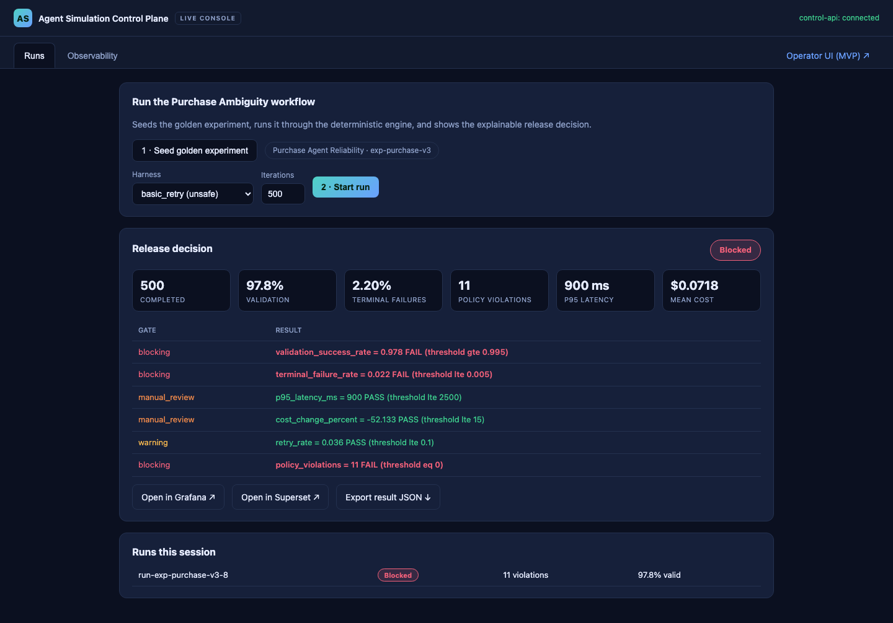
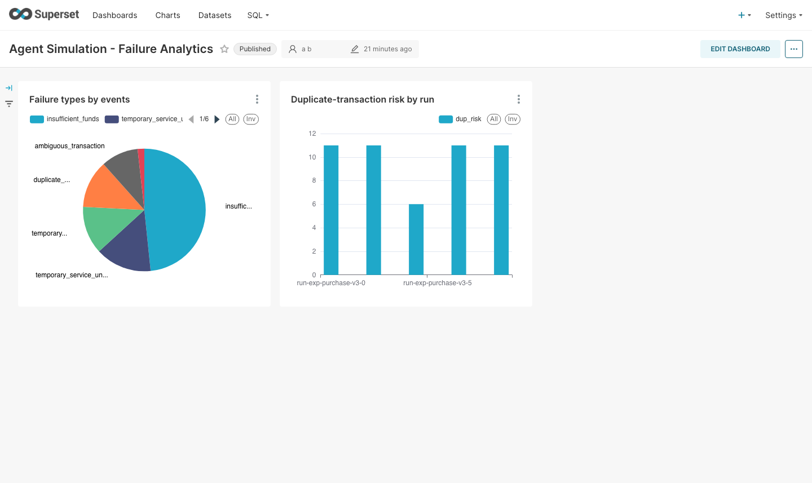
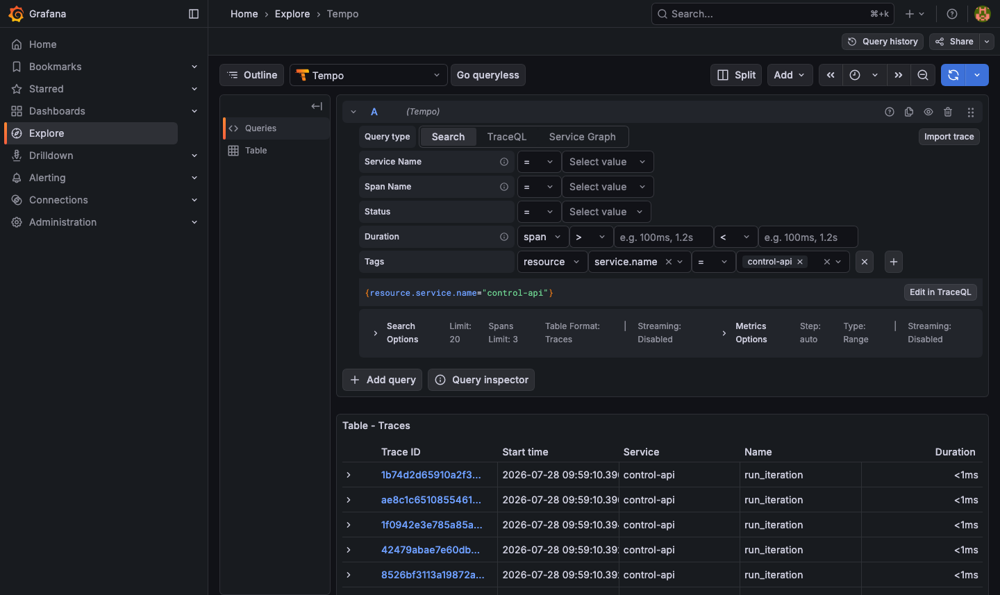

# Deployed and CI evidence - prod integration project

Date: 2026-07-28. Evidence tier: **simulation**. Collected on a local k3d cluster
(`agentsim`, single node, arm64 host) with the lite stack, plus the module CI/CD
phases run locally. Host paths are stripped; screenshots were taken logged out.

Nothing here is narrated: the deployed section is the verbatim output of
`deploy/scripts/collect-evidence.sh`, and the CI section is the verbatim transcript
of the phases in `.github/workflows/prod.yml` run on this host.

## 1. Operator UI drives the golden workflow

Both decisions were produced through the operator console in a browser, against the
in-cluster control-api via the same-origin `/api` proxy - the operator's real path,
not a test harness.

| Harness | Decision | Validation | Terminal failures | Policy violations |
|---------|----------|-----------|-------------------|-------------------|
| `basic_retry` (unsafe) | **Blocked** | 97.8% | 2.20% | 11 |
| `transaction_safety` (safe) | **Passed** | 100.0% | 0.00% | 0 |

The blocking gates on the unsafe run were `validation_success_rate` (0.978 against a
0.995 threshold), `terminal_failure_rate` (0.022 against 0.005), and `policy_violations`
(11 against 0); latency, cost, and retry gates passed in both runs. This is the
explainable scorecard the product exists to produce.



Captured headlessly by driving the console itself - seed, select `basic_retry`, start
run - so the screenshot is reproducible rather than hand-taken.

The v0.1.0 operator surface, re-rendered from the MVP markup in this change:


## 2. Per-hop data and observability chain

Generated output follows.

### collector output

Generated by `deploy/scripts/collect-evidence.sh` on 2026-07-28T17:38:33Z (host arch: arm64,
cluster context: `k3d-agentsim`). Evidence tier: **simulation**. Each hop is verified by the
change a fresh run produces, not by the presence of old data.

#### Golden workflow through the deployed API

| Run | Harness | Decision | Expected |
|-----|---------|----------|----------|
| `run-exp-purchase-v3-6` | basic_retry (unsafe) | Blocked | Blocked |
| `run-exp-purchase-v3-7` | transaction_safety (safe) | Passed | Passed |

#### Per-hop verification

| Hop | Result | Evidence |
|-----|--------|----------|
| control-api (golden workflow) | **PASS** | unsafe -> Blocked, safe -> Passed, 500 iterations each |
| Kafka `sim.iteration.events.v1` | **PASS** | offsets 15318 -> 19525 (+4207 events) |
| Flink failure-stats job | **PASS** | state RUNNING (`insert-into_default_catalog.default_database.failure_stats`) |
| Kafka `sim.failure.stats.v1` | **PASS** | offsets 62 -> 71 (+9 aggregates) |
| ClickHouse `failure_stats` | **PASS** | rows 25 -> 34 (+9) |
| Superset dashboard | **PASS** | all 2 charts return live rows from ClickHouse - chart-1:6 chart-2:8 |
| Grafana -> Tempo traces | **PASS** | 20 control-api traces queryable through the Grafana datasource proxy |
| Telemetry not degraded | **PASS** | KAFKA_BOOTSTRAP set and events observed - emitter is live, not a silent no-op |

#### ClickHouse aggregates (live)

```
   ┌─failureClassification─────────┬─rows─┬─failures─┬─dup─┐
1. │ insufficient_funds            │    8 │      168 │   0 │
2. │ temporary_service_unavailable │    8 │       52 │   0 │
3. │ ambiguous_transaction         │    4 │       39 │   0 │
4. │ temporary_tool_failure        │    4 │       39 │   0 │
5. │ duplicate_transaction_risk    │    4 │       39 │  39 │
6. │ malformed_response            │    6 │        6 │   0 │
   └───────────────────────────────┴──────┴──────────┴─────┘
```

#### Result

**8 passed, 0 failed.**

### Analytics and observability surfaces

The Superset dashboard, provisioned from
[`dashboards/superset/failure-analytics/`](../../dashboards/superset/README.md) and
rendering live from ClickHouse - the `dup_risk` bars are the unsafe runs, the safe runs
sit at zero:



Traces in Grafana Explore over Tempo, filtered to `resource.service.name="control-api"`:



The trace timestamps sit in an earlier window than the run above: Tempo indexes on block
flush, so the freshest run is present in the collector but not yet searchable. The
collector's Grafana hop passes on traces within the collection window for that reason.

## 3. Module CI/CD phases, run locally

Run iteratively on the laptop rather than in a hosted runner, to keep resource use
bounded. Each block is a job in `.github/workflows/prod.yml`.

```text
# Local CI/CD phase transcript - prod module
# Run from prod/ on the integration branch. Phases mirror .github/workflows/prod.yml.

### job: static-checks
$ ruff format --check packages services stream tests conftest.py scripts
63 files already formatted
$ ruff check packages services stream tests conftest.py scripts
All checks passed!
$ for f in deploy/scripts/*.sh; do bash -n $f; done
all 8 shell scripts parse
$ python scripts/verify_package.py
PACKAGE VERIFICATION PASSED
Root: <repo>/prod

### job: contracts
$ python scripts/check_schemas.py
schemas up to date

### job: unit-tests
$ pytest packages services stream -q
57 passed, 1 warning in 5.86s
$ pytest tests/e2e -q
4 passed in 0.52s

### job: golden-workflow (the self-gate)
$ python tests/e2e/golden_runner.py --iterations 1000 --out artifacts/golden
[unsafe] Blocked                violations=19 validation=0.981 p95=900.0ms -> release-decision-unsafe.json
[safe  ] Passed                 violations=0 validation=1.0 p95=900.0ms -> release-decision-safe.json

GOLDEN CHECK: PASS (unsafe=Blocked, safe=Passed)
$ git diff --quiet -- artifacts/golden   # baseline drift guard
release decisions reproduce the accepted baseline exactly

### job: prod-policy-guards
no hardcoded registries
no home paths
dashboard credentials masked

### repo-level policy (.github/workflows/policy.yml)
$ bash tools/policy/check_pii.sh tree
PII scan clean
$ bash tools/policy/check_links.sh
markdown links OK
```

## 4. What this does not prove

- **Simulation tier only.** Every number above describes a simulated population under
  declared failure distributions. No physical or production behavior was observed.
- **Single host, single node.** The stack ran on one arm64 k3d node; the OLAP store is
  ClickHouse, not Druid (ADR-0004 update). Nothing here speaks to distributed behavior.
- **Tempo indexing lags.** Traces become searchable on block flush, so a run less than
  a few minutes old can be absent from the Grafana query while already present in the
  collector's logs. The trace hop passes on traces from the collection window, not
  exclusively on the freshest run.
- **The deployed job is not per-PR.** It runs nightly and on demand; see
  [../design/CICD_STRATEGY.md](../design/CICD_STRATEGY.md).
