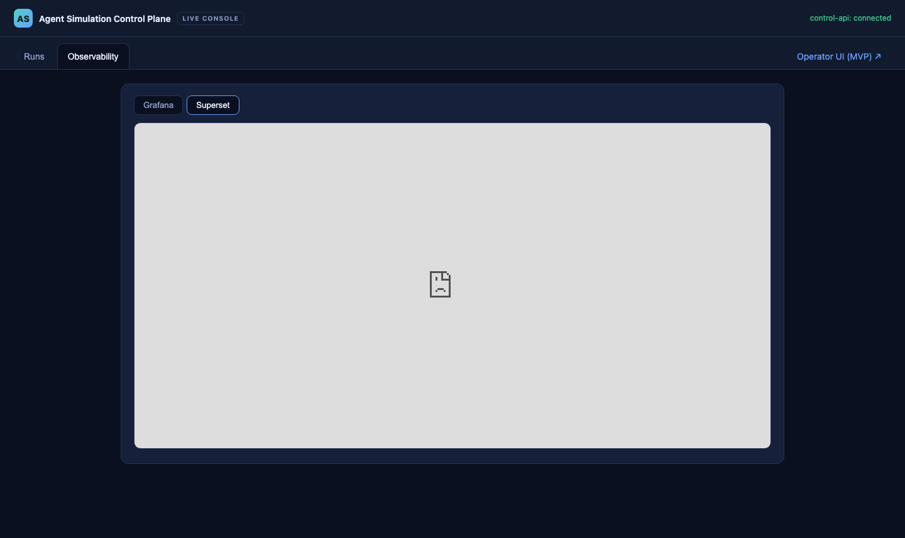
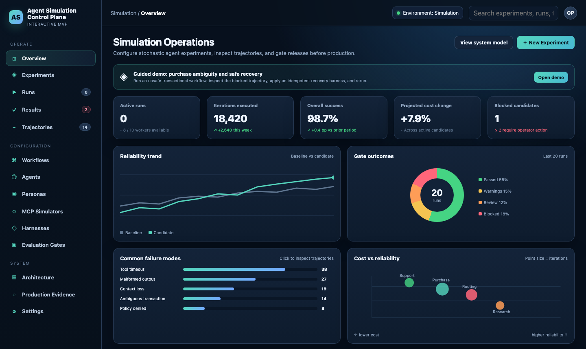
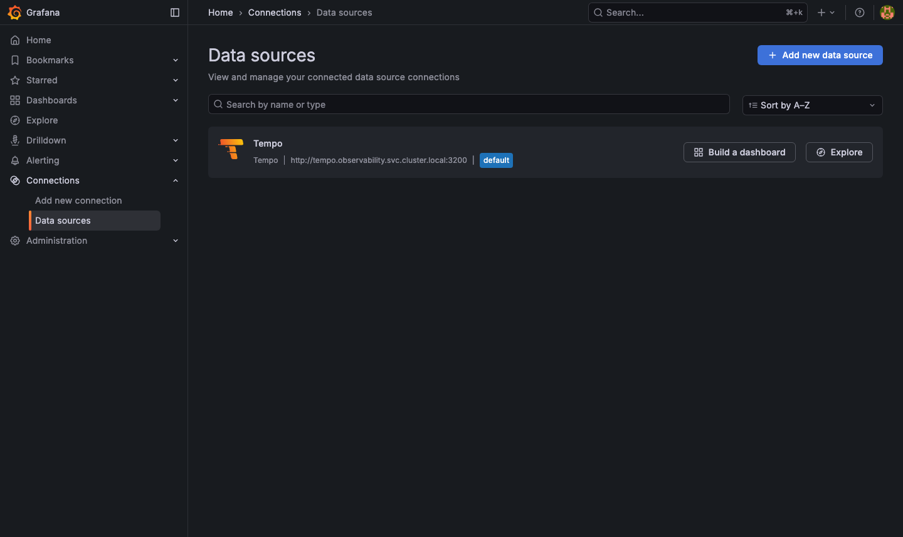
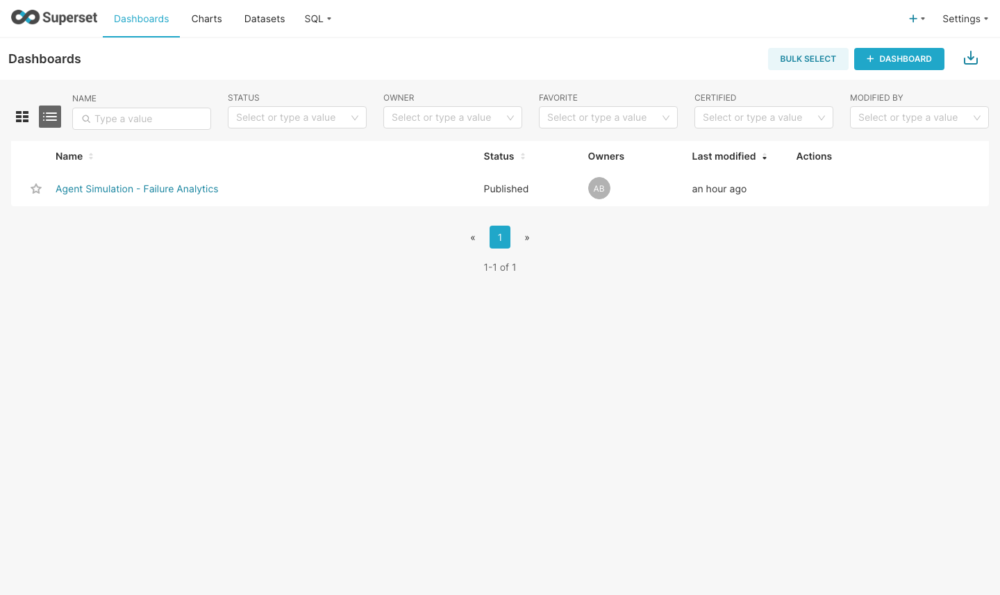
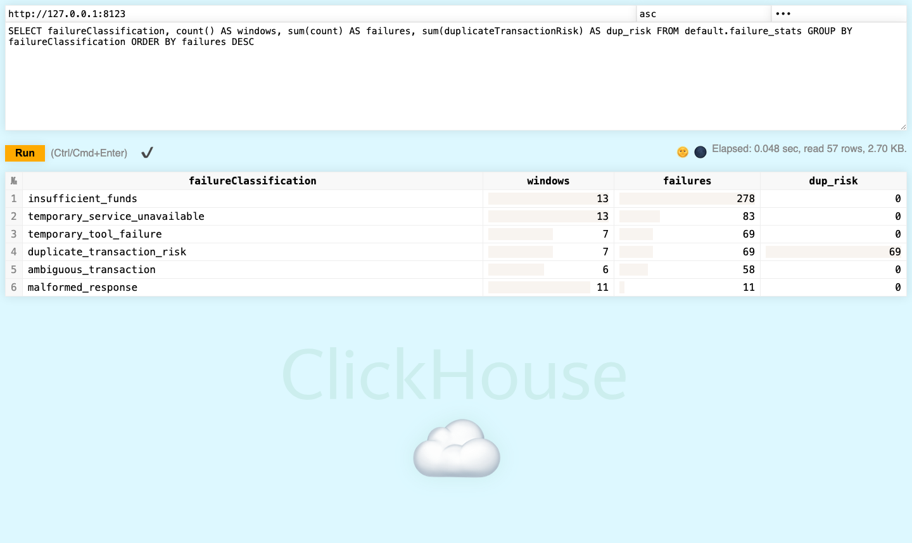

# Running surfaces - what is deployed, and what is wired to what

Date: 2026-07-28. Evidence tier: **simulation**. Local k3d cluster (`agentsim`,
single node, arm64), lite stack. Every screenshot below was captured from that
running cluster by driving the surface headlessly.

This record exists to separate two claims that are easy to blur:

1. **The surfaces are deployed and serve real data.** True, and shown below.
2. **The surfaces are integrated with each other.** **Not true yet.** The operator
   console's embedded Observability tabs and its per-run "Open in Grafana" and
   "Open in Superset" links point at hostnames that do not resolve.

The [data chain](2026-07-28-prod-integration-evidence.md) is verified end to end -
a run reaches Kafka, Flink, ClickHouse, Superset, and Grafana. What is missing is
the *presentation* wiring: reaching those surfaces from inside the console. They
are reachable directly, and that is how the evidence was collected.

## Inventory

| # | Surface | Reachable at | State |
|---|---------|--------------|-------|
| 1 | Operator console - Runs | `http://operator.localhost:8090/` | **Working**: seeds, runs, and renders the explainable release decision |
| 2 | Operator console - Observability | same, Observability tab | **Not wired**: iframe points at `http://grafana.localhost:8080` / `http://superset.localhost:8080`, neither of which resolves |
| 3 | v0.1.0 MVP | `http://operator.localhost:8090/mvp/` | **Working** as the design reference it is meant to be (browser-side deterministic data, no backend) |
| 4 | Control API docs | `http://operator.localhost:8090/api/docs` | **Working** (fixed in this project; it previously could not load its own spec through the proxy) |
| 5 | Grafana | `http://127.0.0.1:3000` | **Working**: Tempo datasource provisioned and returning `control-api` traces |
| 6 | Superset | `http://127.0.0.1:8088` | **Working**: *Agent Simulation - Failure Analytics* provisioned from this repo, charts query ClickHouse live |
| 7 | Flink | `http://127.0.0.1:8081` | **Working**: failure-statistics job RUNNING |
| 8 | ClickHouse | `http://127.0.0.1:8123/play` | **Working**: `default.failure_stats` queryable, 57 rows at capture time |

Surfaces 5-8 are ClusterIP and reachable only while `make dashboards` is running.

## 1-2. Operator console

The Runs tab and its release decision are in
[the integration evidence](2026-07-28-prod-integration-evidence.md). The
Observability tab is the gap:




Both sub-tabs render an empty frame with a broken-document icon. The cause is
configuration, not code:

```text
$ curl -s http://operator.localhost:8090/config.js
window.ASC_CONFIG = {
  controlApiBaseUrl: "/api",
  grafanaBaseUrl:    "http://grafana.localhost:8080",
  supersetBaseUrl:   "http://superset.localhost:8080"
};

$ curl -s -o /dev/null -w '%{http_code}\n' http://grafana.localhost:8080/
000
$ curl -s -o /dev/null -w '%{http_code}\n' http://superset.localhost:8080/
000
```

Those defaults come from `services/operator-web/web/docker-entrypoint.sh` and
assume an ingress layout this deployment does not have: Grafana and Superset have
no Ingress, and `8080` is not the published load-balancer port (k3d published
`8090`). The same class of wrong-by-assumption defect as the `print-urls.sh` bug
fixed earlier in this project.

The control-api's deep links inherit the same bases and additionally reference
dashboards that do not exist:

```text
$ curl -s 'http://operator.localhost:8090/api/observability/links?runId=run-exp-purchase-v3-0'
{"grafana":"http://grafana.localhost:8080/d/asc-run/run-in-progress?var-runId=run-exp-purchase-v3-0",
 "superset":"http://superset.localhost:8080/superset/dashboard/experiment-overview/?runId=run-exp-purchase-v3-0"}
```

There is no Grafana dashboard `asc-run` and no Superset dashboard
`experiment-overview`; the provisioned Superset dashboard is
*Agent Simulation - Failure Analytics*. So fixing the base URLs alone would trade
an empty frame for a "dashboard not found" page. **Both halves - reachable base
URLs and real dashboard targets - are needed, and both are follow-up work.**

## 3. v0.1.0 MVP

Served from the cluster at `/mvp/`, kept as the interaction and visual reference.
Its data is browser-side and deterministic by design; it is not connected to the
control API and is not meant to be.



## 5. Grafana

Tempo provisioned as the default datasource, pointing at the in-cluster Tempo:



Traces returned by that datasource are in
[the integration evidence](2026-07-28-prod-integration-evidence.md).

Prometheus is deliberately absent on this host: the lite path
(`deploy/scripts/deploy-lite.sh`) omits it to fit constrained arm64 machines, so
Grafana carries traces only. The full path adds it.

## 6. Superset

One dashboard, provisioned from
[`dashboards/superset/failure-analytics/`](../../dashboards/superset/README.md)
rather than hand-built:



Four of the five dashboards specified in the original analytics design remain
unbuilt and are deferred to the x86 Druid path.

## 8. ClickHouse

The OLAP store on the arm64 path, queried through its built-in play UI with the
credentials from the manifest:



57 rows across six failure classifications, `duplicate_transaction_risk` carrying
69 - the signal the unsafe harness is supposed to produce and the safe harness is
supposed to eliminate.

## Follow-ups this record opens

1. **Wire the console's observability surfaces.** Base URLs that resolve in the
   deployment being used, plus deep links that target dashboards that exist. The
   base URL is environment-dependent (the browser resolves it, so on a local stack
   it is `127.0.0.1:<forwarded port>`), which is why it belongs in deployment
   configuration and not in an image default.
2. **Provision a Grafana run dashboard** so `asc-run` is a real target.
3. **Map the Superset deep link** to the provisioned dashboard rather than a
   placeholder slug.
