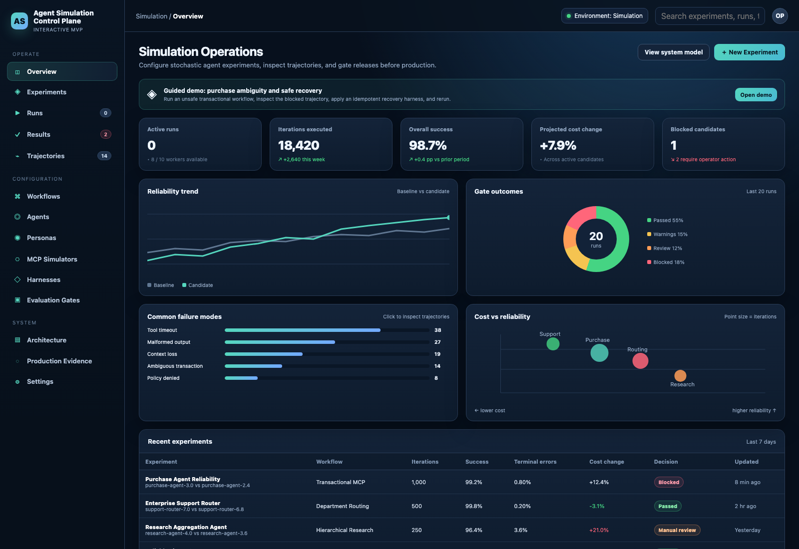
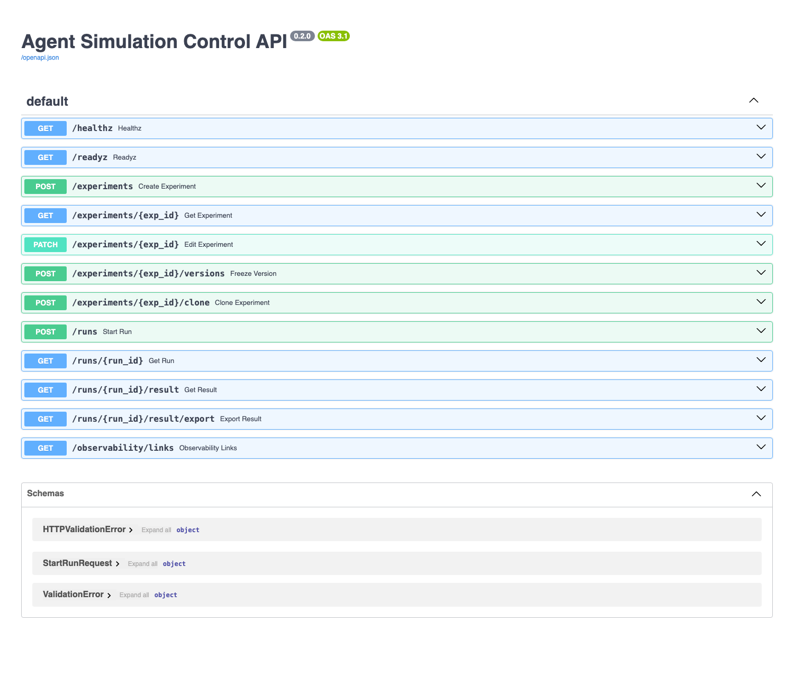
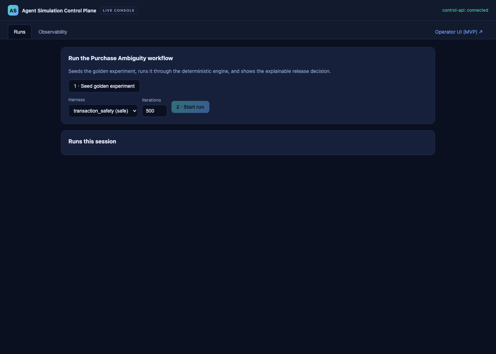
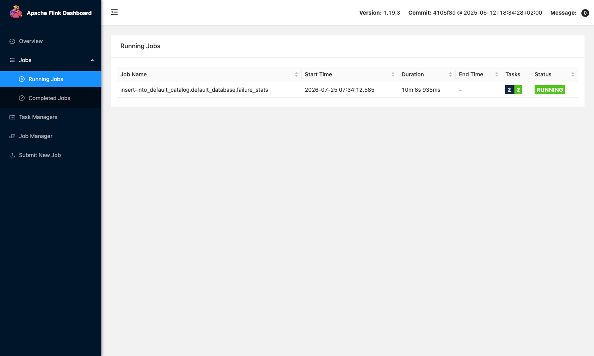

# UI evidence — 2026-07-25

Captured against the running services (local, no cluster): control-api via `uvicorn`, operator UI
served statically. Both are testable today.

## 1. Operator UI (v0.1.0 clickable MVP)

`app/agent_simulation_control_plane_mvp.html` — the operator shell: navigation, KPI tiles, reliability
trend, gate-outcomes donut, failure-mode breakdown, cost-vs-reliability, and the Recent Experiments
table showing Blocked / Passed / Manual-review decisions. Runs in-browser on deterministic data.



## 2. Control API — live Swagger UI

`control-api` `/docs` — the real FastAPI surface wired to the deterministic engine (experiments,
versions, clone, runs, results, export, observability links).



## 3. Live golden workflow through the API (reproducible)

Created the experiment from `examples/purchase_ambiguity_experiment.json` and started two runs:

| Run | Harness | Decision | Evidence |
|---|---|---|---|
| `run-exp-purchase-v3-0` | `basic_retry` (unsafe) | **Blocked** | 11 policy violations, validation 0.978, terminal 0.022 |
| `run-exp-purchase-v3-1` | `transaction_safety` (safe) | **Passed** | 0 policy violations, validation 1.0 |

Explainable gate scorecard served by `GET /runs/{id}/result` for the unsafe run:

```
[blocking]       validation_success_rate = 0.978  FAIL (threshold gte 0.995)
[blocking]       terminal_failure_rate   = 0.022  FAIL (threshold lte 0.005)
[manual_review]  p95_latency_ms          = 900    PASS (threshold lte 2500)
[manual_review]  cost_change_percent     = -52.1  PASS (threshold lte 15)
[warning]        retry_rate              = 0.036  PASS (threshold lte 0.1)
[blocking]       policy_violations       = 11     FAIL (threshold eq 0)
```

## Reproduce

```bash
source .venv/bin/activate
PYTHONPATH=packages/domain/src:packages/telemetry/src:packages/gate-engine/src:packages/simulation-kernel/src:services/simulation-worker/src:services/simulation-orchestrator/src:services/control-api/src \
  ASC_EXAMPLES_DIR=$PWD/examples uvicorn asc_control_api.app:app --port 8010
# open http://127.0.0.1:8010/docs and use "Try it out" on POST /experiments then POST /runs
```

## Not yet wired
- The HTML MVP still uses in-browser mock data; connecting it to control-api + adding the embedded
  Grafana/Superset observability tabs is **ASC-043**.
- Grafana/Superset/Druid UIs arrive with the analytics/observability deploy PRs (ASC-032/033/040-042),
  which need the deferred cluster.

## 4. Deployed on local k3s (2026-07-25)

The platform services run on a k3d cluster (`agentsim`); the operator-web console (in-cluster) drives
runs against the in-cluster control-api via the same-origin `/api` nginx proxy. Verified: **unsafe →
Blocked, safe → Passed across 4 consecutive runs, 0 restarts**.



```
kubectl -n platform get pods     # control-api, mcp-simulator-proxy, operator-web all 1/1 Running
POST /experiments/seed-golden ; POST /runs {harness: basic_retry}  -> Blocked
                                POST /runs {harness: transaction_safety} -> Passed
```

## 5. Data + observability flow on local k3s (2026-07-25)

Full end-to-end on the `agentsim` k3d cluster (memory-trimmed lite stack):

**Data plane** — control-api → worker → **Kafka** (`sim.iteration.events.v1`, 1852+ events) →
**Flink SQL session cluster** (JobManager + TaskManager, JVM) → **`sim.failure.stats.v1`**:

```
{"runId":"run-exp-purchase-v3-0","failureClassification":"duplicate_transaction_risk","count":6,"duplicateTransactionRisk":6,...}
{"runId":"run-exp-purchase-v3-2","failureClassification":"duplicate_transaction_risk","count":5,"duplicateTransactionRisk":5,...}
```
The Flink job (`insert-into ... failure_stats`) runs on the cluster (2 tasks, state RUNNING).



**Observability plane** — services → **OTel Collector** (50 spans/run with `asc.run_id` /
`asc.iteration` / `asc.trajectory_id` / `asc.seed` correlation attributes) → **Tempo** →
**Grafana** Explore (control-api `run_iteration` traces, drill-down waterfall). Verified via the
Grafana→Tempo datasource proxy and in the Grafana UI.

Notes: PyFlink has no arm64 wheels, so the JVM **Flink SQL session cluster** is used locally
(the operator/PyFlink path targets x86); processing-time windows are used for reliable firing;
Druid/Superset are deferred (memory). The failure-stats logic has tested parity with the Python
reference (`asc_flink.compute_failure_stats`).

## 6. OLAP analytics — ClickHouse + Superset on local k3s (2026-07-25)

Apache Druid ships no arm64 image (amd64-only/distroless; Helm subcharts on removed Bitnami images),
so on this Apple Silicon host the OLAP store is **ClickHouse** (arm64-native, ADR-0004 alternative).
Full flow: control-api → Kafka → Flink → `sim.failure.stats.v1` → **ClickHouse** (Kafka engine +
materialized view → MergeTree) → **Superset** dashboard.

ClickHouse `failure_stats` aggregates (live):

| failureClassification | events | duplicateTransactionRisk |
|---|---|---|
| insufficient_funds | 86 | 0 |
| temporary_tool_failure | 44 | 0 |
| duplicate_transaction_risk | 44 | 44 |
| temporary_service_unavailable | 42 | 0 |

Superset dashboard **"Agent Simulation – Failure Analytics"** renders two charts live from
ClickHouse: a *Failure types by events* pie and a *Duplicate-transaction risk by run* bar. Deployed
via `deploy/k3s/components/clickhouse/` + `deploy/k3s/components/superset/` (single-pod, arm64).
